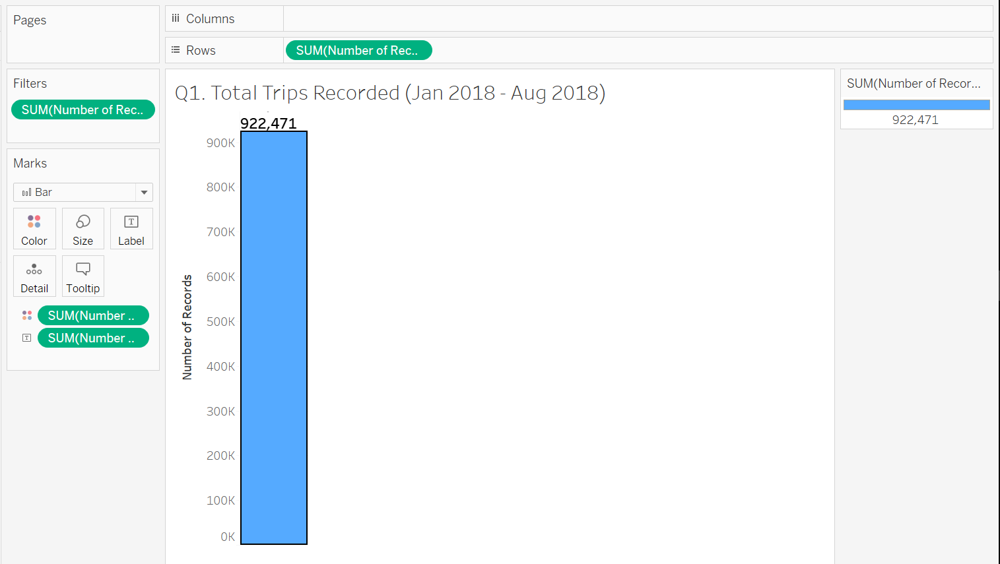
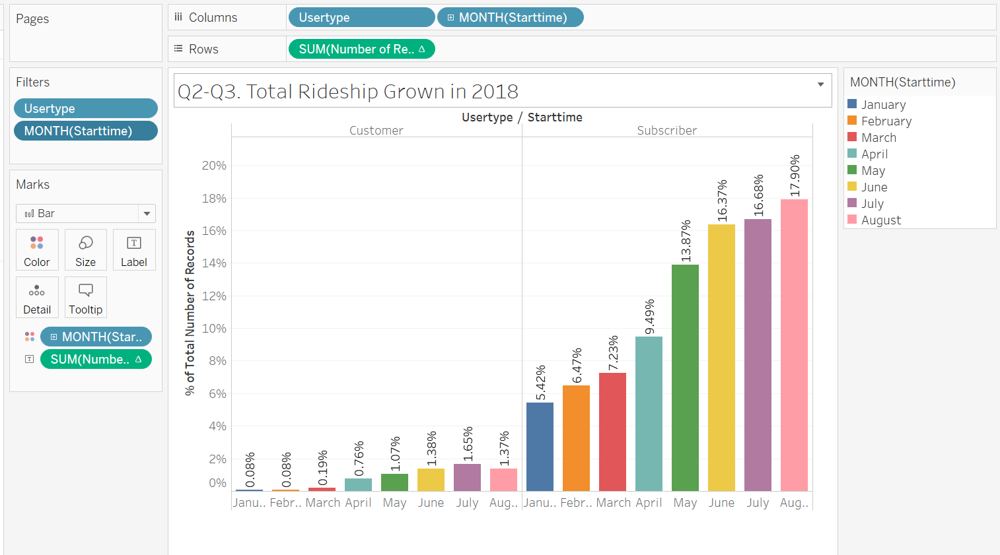
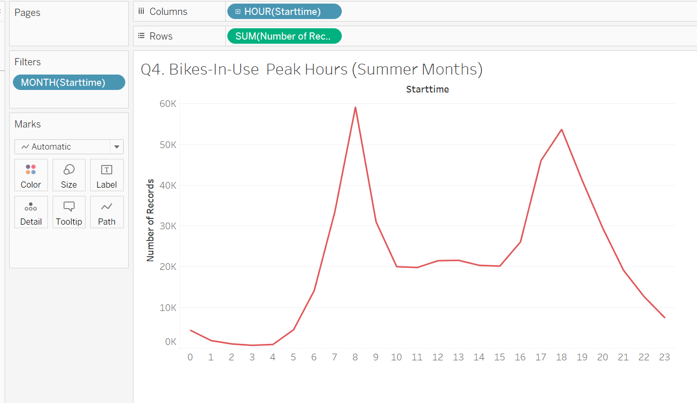
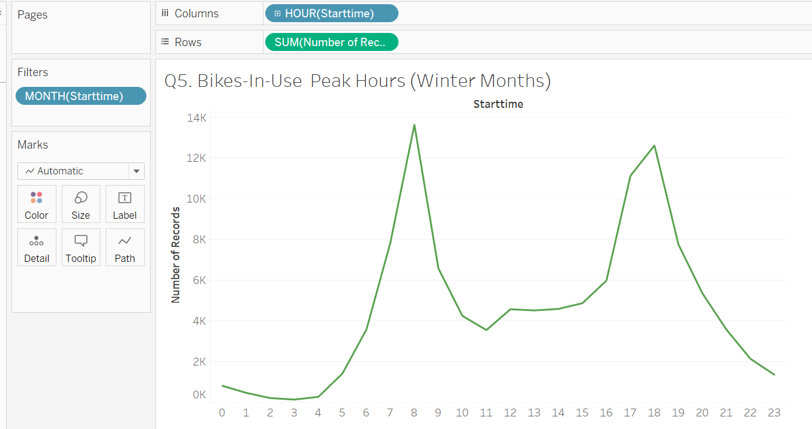
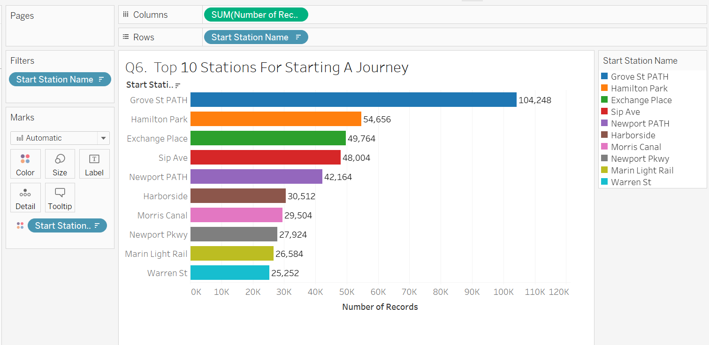

<!--lint enable no-heading-punctuation-->

# Analysis of Citi Bike Rides in NYC 
## Tableau Data Visualization 

Since 2013, the Citi Bike Program has implemented a robust infrastructure for collecting data on the program's utilization. Through the team's efforts, each month bike data is collected, organized, and made public on the [Citi Bike Data](https://www.citibikenyc.com/system-data) webpage.
City officials have a number of questions on the program. This analysis gives visual answers to the following questions.

<!--lint disable no-heading-punctuation-->

## Citi Bike Program Questions:

### 1. How many trips have been recorded total during the chosen period?

- - -
### 2. By what percentage has total ridership grown? 
###    How has the proportion of short-term customers and annual subscribers changed?

- - -
### 3. What are the peak hours in which bikes are used during summer months? 

- - -
### 4. What are the peak hours in which bikes are used during winter months?

- - -
### 5. What are the top 10 stations in the city for starting a journey? 

