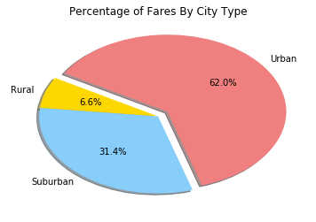
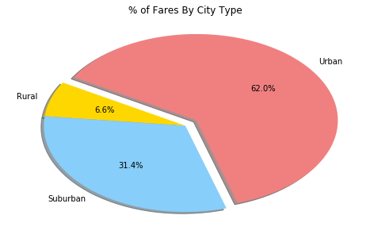
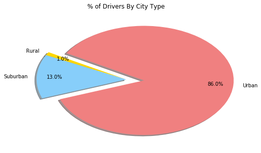

# Pyber Analysis

* From the first glance, it is clear that the most amount of drivers and rides is located in the urban area. Given that urban population is more concentrated, this creates a higher competition for the fare rate, and inevitably, an urban fare is the lowest comparing to the suburban and rural areas. 


* Fares in the suburban area are higher, and there are fewer rides in comparison with the urban area.


* An amount of rides in the rural areas is the lowest compared to the rides in the urban area. Considering a small number of drivers in the rural area, rural drivers are charging the highest fares comparing to the fares in suburban and urban areas.


```python
# Dependencies 
import csv 
import matplotlib.pyplot as plt
import pandas as pd
```


```python
# Read csv files
city_df = pd.read_csv('raw_data/city_data.csv')
ride_df = pd.read_csv('raw_data/ride_data.csv')
```


```python
# Combine both files based on common column "city"
rides_df = pd.merge(ride_df, city_df, how="left", on="city")

```


```python
rides_df.head()
```


<!-- <div>
<style scoped>
    .dataframe tbody tr th:only-of-type {
        vertical-align: middle;
    }

    .dataframe tbody tr th {
        vertical-align: top;
    }

    .dataframe thead th {
        text-align: right;
    }
</style> -->

<table border="1" class="dataframe">
  <thead>
    <tr style="text-align: right;">
      <th></th>
      <th>city</th>
      <th>date</th>
      <th>fare</th>
      <th>ride_id</th>
      <th>driver_count</th>
      <th>type</th>
    </tr>
  </thead>
  <tbody>
    <tr>
      <th>0</th>
      <td>Sarabury</td>
      <td>2016-01-16 13:49:27</td>
      <td>38.35</td>
      <td>5403689035038</td>
      <td>46</td>
      <td>Urban</td>
    </tr>
    <tr>
      <th>1</th>
      <td>South Roy</td>
      <td>2016-01-02 18:42:34</td>
      <td>17.49</td>
      <td>4036272335942</td>
      <td>35</td>
      <td>Urban</td>
    </tr>
    <tr>
      <th>2</th>
      <td>Wiseborough</td>
      <td>2016-01-21 17:35:29</td>
      <td>44.18</td>
      <td>3645042422587</td>
      <td>55</td>
      <td>Urban</td>
    </tr>
    <tr>
      <th>3</th>
      <td>Spencertown</td>
      <td>2016-07-31 14:53:22</td>
      <td>6.87</td>
      <td>2242596575892</td>
      <td>68</td>
      <td>Urban</td>
    </tr>
    <tr>
      <th>4</th>
      <td>Nguyenbury</td>
      <td>2016-07-09 04:42:44</td>
      <td>6.28</td>
      <td>1543057793673</td>
      <td>8</td>
      <td>Urban</td>
    </tr>
  </tbody>
</table>
</div>


```python
# Create data sets for urban, suburban, and rural rides
urban = rides_df[rides_df["type"] == "Urban"]
suburban = rides_df[rides_df["type"] == "Suburban"]
rural = rides_df[rides_df["type"] == "Rural"]

# Count average fare price, total rides, and total drivers in 3 areas
urban_avg_fare = urban.groupby('city').mean()['fare']
urban_ride_count = urban.groupby('city').count()['ride_id']
urban_driver_count = urban.groupby('city').count()['driver_count']

suburban_avg_fare = suburban.groupby('city').mean()['fare']
suburban_ride_count = suburban.groupby('city').count()['ride_id']
suburban_driver_count = suburban.groupby('city').count()['driver_count']

rural_avg_fare = rural.groupby('city').mean()['fare']
rural_ride_count = rural.groupby('city').count()['ride_id']
rural_driver_count = rural.groupby('city').count()['driver_count']
```

## Bubble Plot of Rides Data


```python
# Create scatter plots according to the urban, suburban, and rural areas
plt.figure(figsize=(10,7))
plt.scatter(urban_ride_count, urban_avg_fare, 
           s=20*urban_driver_count, marker='o',
           color='coral' , edgecolor='black',
            linewidths=1, alpha=0.8, label='Urban')

plt.scatter(suburban_ride_count, suburban_avg_fare,
            s=20*suburban_driver_count, marker='o',
            color='skyblue', edgecolor='black',
            linewidths=1, alpha=0.8, label='Suburban')

plt.scatter(rural_ride_count, rural_avg_fare,
           s=20*rural_driver_count, marker='o',
            color='gold', edgecolor='black',
            linewidths=1, alpha=0.8, label='Rural')

# Set up legend
ride_legend = plt.legend(fontsize='medium', mode='Expanded', numpoints=1, 
                         scatterpoints=1, loc='upper right',title='City Types', labelspacing=0.8)
ride_legend.legendHandles[0]._sizes = [40]
ride_legend.legendHandles[1]._sizes = [40]
ride_legend.legendHandles[2]._sizes = [40]


# Display plots
plt.title('Pyber Rides 2016')
plt.ylabel('Average Fare ($)')
plt.xlabel('Total Number Rides Per City')
plt.text(75, 35, 'Note:\nCircle size correlates with drivers coount per city.')
plt.xlim(0,70)
plt.grid(True)
plt.savefig('fig1.png')
plt.show()
```





## Total Fares by City Type


```python
# Calculate the percentage of fares by city type - fares by areas / sum of all fares
plt.figure(figsize=(8,5))
percent_by_type = 100*rides_df.groupby("type").sum()["fare"] / rides_df['fare'].sum() 


# Create pie chart 
plt.pie(percent_by_type, 
        labels=["Rural", "Suburban", "Urban"],
        colors=["gold", "lightskyblue", "lightcoral"], 
        autopct='%1.1f%%',
        explode=[0,0,0.1], 
        shadow=True, startangle=150)
plt.title('% of Fares By City Type')
#Save figure
plt.savefig('fig2.png')
# Display figure
plt.show()
```





## Total Rides by City Type


```python
# Calculate the percentage of fares by city type - fares by areas / sum of all fares
plt.figure(figsize=(8,5))
percent_by_ride = 100*rides_df.groupby("type").count()["ride_id"] / rides_df['ride_id'].count() 

# Create pie chart 
plt.pie(percent_by_type, 
        labels=["Rural", "Suburban", "Urban"],
        colors=["gold", "lightskyblue", "lightcoral"], 
        autopct='%1.1f%%',
        explode=[0,0,0.1], 
        shadow=True, startangle=150)
plt.title('% of Rides By City Type')
#Save figure
plt.savefig('fig3.png')
# Display figure
plt.show()
```


## Total Drivers by City Type


```python
# Calculate the percentage of fares by city type - fares by areas / sum of all fares
plt.figure(figsize=(8,5))
percent_by_driver = 100*rides_df.groupby("type").sum()["driver_count"] / rides_df['driver_count'].sum() 

# Create pie chart 
plt.pie(percent_by_driver, 
        labels=["Rural", "Suburban", "Urban"],
        colors=["gold", "lightskyblue", "lightcoral"], 
        autopct='%1.1f%%',
        explode=[0,0,0.2], 
        shadow=True, startangle=150, pctdistance = 0.80)
plt.title('% of Drivers By City Type')
#Save figure
plt.savefig('fig4.png')
# Display figure
plt.show()
```




