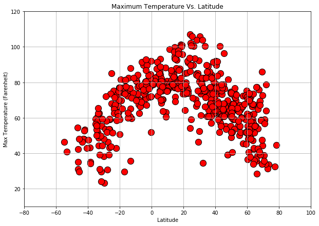
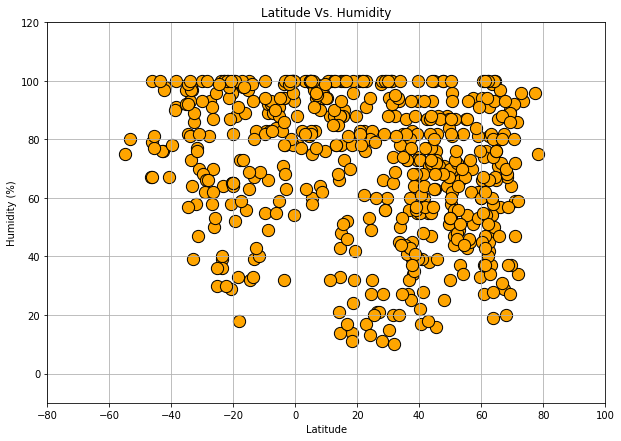
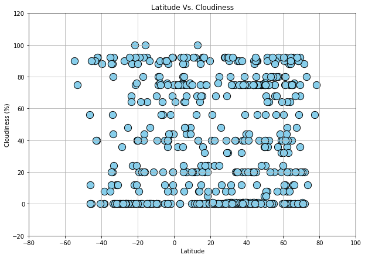

## WeatherPy - OpenWeatherMap

### Focus Question: "What's the weather like as we approach the equator?"


* As expected, temperature is rising as we approach the equator. But, surprisingly, maximum temperatures are recorded well before we reach the equator - 20 degrees above the equator, in the northern hemisphere.


* Humidity at its maximum levels is recorded on the equator line. Only a small amount of cities located precisely on the equator line has been recorded, so we can not make a complete conclusion about the level of humidity on the 0 degrees line.


* Cloudiness does not show any relationship with location around the globe. Clouds are evenly distributed and are not affected by their distance to the equator.


* Interestingly, wind shows a similar relationship to the equator as the maximum temperatures. The highest wind speed is recorded at 20 degrees longitude, in the northern hemisphere. On the equator line, wind speed has no outstanding records, displaying somewhat average speed compared to the rest of the planet.


```python
# Import dependecies
import pandas as pd
import numpy as np
import matplotlib.pyplot as plt
import requests
from citipy import citipy
from config import openweatherkey
```


```python
# Random coordinates selection
lat = np.random.uniform(low=-90.000, high=90.000, size=1500)
lng = np.random.uniform(low=-180.000, high=180.000, size=1500)
```


```python
# Combine coordinates in one combination using zip function
coordinates = zip(lat, lng)
city_list = []

# Using coordinates and citipy, collect city names
for coord in coordinates:
    city = citipy.nearest_city(coord[0], coord[1]).city_name
    
    # Eliminating duplicates 
    if city not in city_list:
        city_list.append(city)
```


```python
# Total of cities
len(city_list)
```


    622


```python
# Build url to call for the infomation
url = "http://api.openweathermap.org/data/2.5/weather?units=Imperial&APPID=" + openweatherkey

# Build base where our data will be stored
weather_dict = {"city": [],
                "lat": [],
                "lon": [],
                "temp_max": [],
                "humidity": [],
                "cloudiness": [],
                "wind_speed": []}

city_counter = 0


print('-------------------------------------------------------------')
print('Beginning Data Retrieval')
print('-------------------------------------------------------------')

# Create a query
for city in city_list:
    try:
        response = requests.get(url + "&q=" + city)
        query = response.json()
        
    # Pull data from the url using query request and add it to dataset
        weather_dict['city'].append(query['name'])
        weather_dict['lat'].append(query['coord']['lat'])
        weather_dict['lon'].append(query['coord']['lon'])
        weather_dict['temp_max'].append(query['main']['temp_max'])
        weather_dict['humidity'].append(query['main']['humidity'])
        weather_dict['cloudiness'].append(query['clouds']['all'])
        weather_dict['wind_speed'].append(query['wind']['speed'])
        
        city_counter += 1
         
        print(f"Retrieving records for city #{str(city_counter)} | {query['name']}")
        print(response.url)
        
    # Eliminating missing infomation and errors
    except:
#         print("City not found, skipping the data...")
        pass


print('-------------------------------------------------------------')
print('Data Retrieval Completed')
print('-------------------------------------------------------------')
    
```

    -------------------------------------------------------------
    Beginning Data Retrieval
    -------------------------------------------------------------
    Retrieving records for city #1 | New Norfolk
    http://api.openweathermap.org/data/2.5/weather?units=Imperial&APPID=e444fda544927f943f8f58445259f656&q=new%20norfolk
    Retrieving records for city #2 | Teguldet
    http://api.openweathermap.org/data/2.5/weather?units=Imperial&APPID=e444fda544927f943f8f58445259f656&q=teguldet
    Retrieving records for city #3 | Hobart
    http://api.openweathermap.org/data/2.5/weather?units=Imperial&APPID=e444fda544927f943f8f58445259f656&q=hobart
    Retrieving records for city #4 | Barrow
    http://api.openweathermap.org/data/2.5/weather?units=Imperial&APPID=e444fda544927f943f8f58445259f656&q=barrow
    Retrieving records for city #5 | Cayenne
    http://api.openweathermap.org/data/2.5/weather?units=Imperial&APPID=e444fda544927f943f8f58445259f656&q=cayenne
    Retrieving records for city #6 | Jamestown
    http://api.openweathermap.org/data/2.5/weather?units=Imperial&APPID=e444fda544927f943f8f58445259f656&q=jamestown
    Retrieving records for city #7 | Dikson
    http://api.openweathermap.org/data/2.5/weather?units=Imperial&APPID=e444fda544927f943f8f58445259f656&q=dikson
    Retrieving records for city #8 | Kadoma
    http://api.openweathermap.org/data/2.5/weather?units=Imperial&APPID=e444fda544927f943f8f58445259f656&q=kadoma
    Retrieving records for city #9 | Bamenda
    http://api.openweathermap.org/data/2.5/weather?units=Imperial&APPID=e444fda544927f943f8f58445259f656&q=bamenda
    Retrieving records for city #10 | Hobyo
    http://api.openweathermap.org/data/2.5/weather?units=Imperial&APPID=e444fda544927f943f8f58445259f656&q=hobyo
    Retrieving records for city #11 | Cedar City
    http://api.openweathermap.org/data/2.5/weather?units=Imperial&APPID=e444fda544927f943f8f58445259f656&q=cedar%20city
    Retrieving records for city #12 | Honiara
    http://api.openweathermap.org/data/2.5/weather?units=Imperial&APPID=e444fda544927f943f8f58445259f656&q=honiara
    Retrieving records for city #13 | Sao Filipe
    http://api.openweathermap.org/data/2.5/weather?units=Imperial&APPID=e444fda544927f943f8f58445259f656&q=sao%20filipe
    Retrieving records for city #14 | Derzhavinsk
    http://api.openweathermap.org/data/2.5/weather?units=Imperial&APPID=e444fda544927f943f8f58445259f656&q=derzhavinsk
    Retrieving records for city #15 | Kuryk
    http://api.openweathermap.org/data/2.5/weather?units=Imperial&APPID=e444fda544927f943f8f58445259f656&q=kuryk
    Retrieving records for city #16 | Taoudenni
    http://api.openweathermap.org/data/2.5/weather?units=Imperial&APPID=e444fda544927f943f8f58445259f656&q=taoudenni
    Retrieving records for city #17 | Paracuru
    http://api.openweathermap.org/data/2.5/weather?units=Imperial&APPID=e444fda544927f943f8f58445259f656&q=paracuru
    Retrieving records for city #18 | Kodiak
    http://api.openweathermap.org/data/2.5/weather?units=Imperial&APPID=e444fda544927f943f8f58445259f656&q=kodiak
    Retrieving records for city #19 | Luocheng
    http://api.openweathermap.org/data/2.5/weather?units=Imperial&APPID=e444fda544927f943f8f58445259f656&q=luocheng
    Retrieving records for city #20 | Nikolskoye
    http://api.openweathermap.org/data/2.5/weather?units=Imperial&APPID=e444fda544927f943f8f58445259f656&q=nikolskoye
    Retrieving records for city #21 | Vestmannaeyjar
    http://api.openweathermap.org/data/2.5/weather?units=Imperial&APPID=e444fda544927f943f8f58445259f656&q=vestmannaeyjar
    Retrieving records for city #22 | Antalaha
    http://api.openweathermap.org/data/2.5/weather?units=Imperial&APPID=e444fda544927f943f8f58445259f656&q=antalaha
    Retrieving records for city #23 | Khatanga
    http://api.openweathermap.org/data/2.5/weather?units=Imperial&APPID=e444fda544927f943f8f58445259f656&q=khatanga
    Retrieving records for city #24 | Albany
    http://api.openweathermap.org/data/2.5/weather?units=Imperial&APPID=e444fda544927f943f8f58445259f656&q=albany
    Retrieving records for city #25 | Yellowknife
    http://api.openweathermap.org/data/2.5/weather?units=Imperial&APPID=e444fda544927f943f8f58445259f656&q=yellowknife
    Retrieving records for city #26 | Mahebourg
    http://api.openweathermap.org/data/2.5/weather?units=Imperial&APPID=e444fda544927f943f8f58445259f656&q=mahebourg
    Retrieving records for city #27 | Tacuarembo
    http://api.openweathermap.org/data/2.5/weather?units=Imperial&APPID=e444fda544927f943f8f58445259f656&q=tacuarembo
    Retrieving records for city #28 | Kendari
    http://api.openweathermap.org/data/2.5/weather?units=Imperial&APPID=e444fda544927f943f8f58445259f656&q=kendari
    Retrieving records for city #29 | Ixtapa
    http://api.openweathermap.org/data/2.5/weather?units=Imperial&APPID=e444fda544927f943f8f58445259f656&q=ixtapa
    Retrieving records for city #30 | Mandalgovi
    http://api.openweathermap.org/data/2.5/weather?units=Imperial&APPID=e444fda544927f943f8f58445259f656&q=mandalgovi
    Retrieving records for city #31 | Rikitea
    http://api.openweathermap.org/data/2.5/weather?units=Imperial&APPID=e444fda544927f943f8f58445259f656&q=rikitea
    Retrieving records for city #32 | Tuktoyaktuk
    http://api.openweathermap.org/data/2.5/weather?units=Imperial&APPID=e444fda544927f943f8f58445259f656&q=tuktoyaktuk
    Retrieving records for city #33 | Tasiilaq
    http://api.openweathermap.org/data/2.5/weather?units=Imperial&APPID=e444fda544927f943f8f58445259f656&q=tasiilaq
    Retrieving records for city #34 | Langsa
    http://api.openweathermap.org/data/2.5/weather?units=Imperial&APPID=e444fda544927f943f8f58445259f656&q=langsa
    Retrieving records for city #35 | Cotonou
    http://api.openweathermap.org/data/2.5/weather?units=Imperial&APPID=e444fda544927f943f8f58445259f656&q=cotonou
    Retrieving records for city #36 | Le Port
    http://api.openweathermap.org/data/2.5/weather?units=Imperial&APPID=e444fda544927f943f8f58445259f656&q=le%20port
    Retrieving records for city #37 | Ushuaia
    http://api.openweathermap.org/data/2.5/weather?units=Imperial&APPID=e444fda544927f943f8f58445259f656&q=ushuaia
    Retrieving records for city #38 | Palmer
    http://api.openweathermap.org/data/2.5/weather?units=Imperial&APPID=e444fda544927f943f8f58445259f656&q=palmer
    Retrieving records for city #39 | Novyy Urengoy
    http://api.openweathermap.org/data/2.5/weather?units=Imperial&APPID=e444fda544927f943f8f58445259f656&q=novyy%20urengoy
    Retrieving records for city #40 | Punta Arenas
    http://api.openweathermap.org/data/2.5/weather?units=Imperial&APPID=e444fda544927f943f8f58445259f656&q=punta%20arenas
    Retrieving records for city #41 | Hithadhoo
    http://api.openweathermap.org/data/2.5/weather?units=Imperial&APPID=e444fda544927f943f8f58445259f656&q=hithadhoo
    Retrieving records for city #42 | Willowmore
    http://api.openweathermap.org/data/2.5/weather?units=Imperial&APPID=e444fda544927f943f8f58445259f656&q=willowmore
    Retrieving records for city #43 | Saint-Philippe
    http://api.openweathermap.org/data/2.5/weather?units=Imperial&APPID=e444fda544927f943f8f58445259f656&q=saint-philippe
    Retrieving records for city #44 | Yulara
    http://api.openweathermap.org/data/2.5/weather?units=Imperial&APPID=e444fda544927f943f8f58445259f656&q=yulara
    Retrieving records for city #45 | Praia
    http://api.openweathermap.org/data/2.5/weather?units=Imperial&APPID=e444fda544927f943f8f58445259f656&q=praia
    Retrieving records for city #46 | Bandarbeyla
    http://api.openweathermap.org/data/2.5/weather?units=Imperial&APPID=e444fda544927f943f8f58445259f656&q=bandarbeyla
    Retrieving records for city #47 | Shugurovo
    http://api.openweathermap.org/data/2.5/weather?units=Imperial&APPID=e444fda544927f943f8f58445259f656&q=shugurovo
    Retrieving records for city #48 | Mount Isa
    http://api.openweathermap.org/data/2.5/weather?units=Imperial&APPID=e444fda544927f943f8f58445259f656&q=mount%20isa
    Retrieving records for city #49 | Upernavik
    http://api.openweathermap.org/data/2.5/weather?units=Imperial&APPID=e444fda544927f943f8f58445259f656&q=upernavik
    Retrieving records for city #50 | Bredasdorp
    http://api.openweathermap.org/data/2.5/weather?units=Imperial&APPID=e444fda544927f943f8f58445259f656&q=bredasdorp
    Retrieving records for city #51 | Diego de Almagro
    http://api.openweathermap.org/data/2.5/weather?units=Imperial&APPID=e444fda544927f943f8f58445259f656&q=diego%20de%20almagro
    Retrieving records for city #52 | Mataura
    http://api.openweathermap.org/data/2.5/weather?units=Imperial&APPID=e444fda544927f943f8f58445259f656&q=mataura
    Retrieving records for city #53 | Ancud
    http://api.openweathermap.org/data/2.5/weather?units=Imperial&APPID=e444fda544927f943f8f58445259f656&q=ancud
    Retrieving records for city #54 | Ornskoldsvik
    http://api.openweathermap.org/data/2.5/weather?units=Imperial&APPID=e444fda544927f943f8f58445259f656&q=ornskoldsvik
    Retrieving records for city #55 | Berlevag
    http://api.openweathermap.org/data/2.5/weather?units=Imperial&APPID=e444fda544927f943f8f58445259f656&q=berlevag
    Retrieving records for city #56 | Pangai
    http://api.openweathermap.org/data/2.5/weather?units=Imperial&APPID=e444fda544927f943f8f58445259f656&q=pangai
    Retrieving records for city #57 | Alberton
    http://api.openweathermap.org/data/2.5/weather?units=Imperial&APPID=e444fda544927f943f8f58445259f656&q=alberton
    Retrieving records for city #58 | Seoul
    http://api.openweathermap.org/data/2.5/weather?units=Imperial&APPID=e444fda544927f943f8f58445259f656&q=seoul
    Retrieving records for city #59 | Suamico
    http://api.openweathermap.org/data/2.5/weather?units=Imperial&APPID=e444fda544927f943f8f58445259f656&q=suamico
    Retrieving records for city #60 | Benjamin Constant
    http://api.openweathermap.org/data/2.5/weather?units=Imperial&APPID=e444fda544927f943f8f58445259f656&q=benjamin%20constant
    Retrieving records for city #61 | Atuona
    http://api.openweathermap.org/data/2.5/weather?units=Imperial&APPID=e444fda544927f943f8f58445259f656&q=atuona
    Retrieving records for city #62 | Luwuk
    http://api.openweathermap.org/data/2.5/weather?units=Imperial&APPID=e444fda544927f943f8f58445259f656&q=luwuk
    Retrieving records for city #63 | Santo Tomas
    http://api.openweathermap.org/data/2.5/weather?units=Imperial&APPID=e444fda544927f943f8f58445259f656&q=santo%20tomas
    Retrieving records for city #64 | Vaini
    http://api.openweathermap.org/data/2.5/weather?units=Imperial&APPID=e444fda544927f943f8f58445259f656&q=vaini
    Retrieving records for city #65 | Snohomish
    http://api.openweathermap.org/data/2.5/weather?units=Imperial&APPID=e444fda544927f943f8f58445259f656&q=snohomish
    Retrieving records for city #66 | Narsaq
    http://api.openweathermap.org/data/2.5/weather?units=Imperial&APPID=e444fda544927f943f8f58445259f656&q=narsaq
    Retrieving records for city #67 | Barra do Garcas
    http://api.openweathermap.org/data/2.5/weather?units=Imperial&APPID=e444fda544927f943f8f58445259f656&q=barra%20do%20garcas
    Retrieving records for city #68 | Mar del Plata
    http://api.openweathermap.org/data/2.5/weather?units=Imperial&APPID=e444fda544927f943f8f58445259f656&q=mar%20del%20plata
    Retrieving records for city #69 | Marawi
    http://api.openweathermap.org/data/2.5/weather?units=Imperial&APPID=e444fda544927f943f8f58445259f656&q=marawi
    Retrieving records for city #70 | Faanui
    http://api.openweathermap.org/data/2.5/weather?units=Imperial&APPID=e444fda544927f943f8f58445259f656&q=faanui
    Retrieving records for city #71 | Kruisfontein
    http://api.openweathermap.org/data/2.5/weather?units=Imperial&APPID=e444fda544927f943f8f58445259f656&q=kruisfontein
    Retrieving records for city #72 | Manbij
    http://api.openweathermap.org/data/2.5/weather?units=Imperial&APPID=e444fda544927f943f8f58445259f656&q=manbij
    Retrieving records for city #73 | Lebu
    http://api.openweathermap.org/data/2.5/weather?units=Imperial&APPID=e444fda544927f943f8f58445259f656&q=lebu
    Retrieving records for city #74 | Limon
    http://api.openweathermap.org/data/2.5/weather?units=Imperial&APPID=e444fda544927f943f8f58445259f656&q=limon
    Retrieving records for city #75 | Moose Factory
    http://api.openweathermap.org/data/2.5/weather?units=Imperial&APPID=e444fda544927f943f8f58445259f656&q=moose%20factory
    Retrieving records for city #76 | Carnarvon
    http://api.openweathermap.org/data/2.5/weather?units=Imperial&APPID=e444fda544927f943f8f58445259f656&q=carnarvon
    Retrieving records for city #77 | Mayo
    http://api.openweathermap.org/data/2.5/weather?units=Imperial&APPID=e444fda544927f943f8f58445259f656&q=mayo
    Retrieving records for city #78 | Castro
    http://api.openweathermap.org/data/2.5/weather?units=Imperial&APPID=e444fda544927f943f8f58445259f656&q=castro
    Retrieving records for city #79 | Bluff
    http://api.openweathermap.org/data/2.5/weather?units=Imperial&APPID=e444fda544927f943f8f58445259f656&q=bluff
    Retrieving records for city #80 | Sladkovo
    http://api.openweathermap.org/data/2.5/weather?units=Imperial&APPID=e444fda544927f943f8f58445259f656&q=sladkovo
    Retrieving records for city #81 | Grand Gaube
    http://api.openweathermap.org/data/2.5/weather?units=Imperial&APPID=e444fda544927f943f8f58445259f656&q=grand%20gaube
    Retrieving records for city #82 | Pevek
    http://api.openweathermap.org/data/2.5/weather?units=Imperial&APPID=e444fda544927f943f8f58445259f656&q=pevek
    Retrieving records for city #83 | Buraydah
    http://api.openweathermap.org/data/2.5/weather?units=Imperial&APPID=e444fda544927f943f8f58445259f656&q=buraydah
    Retrieving records for city #84 | Sao Joao da Barra
    http://api.openweathermap.org/data/2.5/weather?units=Imperial&APPID=e444fda544927f943f8f58445259f656&q=sao%20joao%20da%20barra
    Retrieving records for city #85 | Port Blair
    http://api.openweathermap.org/data/2.5/weather?units=Imperial&APPID=e444fda544927f943f8f58445259f656&q=port%20blair
    Retrieving records for city #86 | Inhambane
    http://api.openweathermap.org/data/2.5/weather?units=Imperial&APPID=e444fda544927f943f8f58445259f656&q=inhambane
    Retrieving records for city #87 | Vila Franca do Campo
    http://api.openweathermap.org/data/2.5/weather?units=Imperial&APPID=e444fda544927f943f8f58445259f656&q=vila%20franca%20do%20campo
    Retrieving records for city #88 | Cocobeach
    http://api.openweathermap.org/data/2.5/weather?units=Imperial&APPID=e444fda544927f943f8f58445259f656&q=cocobeach
    Retrieving records for city #89 | Puerto Narino
    http://api.openweathermap.org/data/2.5/weather?units=Imperial&APPID=e444fda544927f943f8f58445259f656&q=puerto%20narino
    Retrieving records for city #90 | Qaanaaq
    http://api.openweathermap.org/data/2.5/weather?units=Imperial&APPID=e444fda544927f943f8f58445259f656&q=qaanaaq
    Retrieving records for city #91 | Sola
    http://api.openweathermap.org/data/2.5/weather?units=Imperial&APPID=e444fda544927f943f8f58445259f656&q=sola
    Retrieving records for city #92 | Airai
    http://api.openweathermap.org/data/2.5/weather?units=Imperial&APPID=e444fda544927f943f8f58445259f656&q=airai
    Retrieving records for city #93 | Copiapo
    http://api.openweathermap.org/data/2.5/weather?units=Imperial&APPID=e444fda544927f943f8f58445259f656&q=copiapo
    Retrieving records for city #94 | Ahipara
    http://api.openweathermap.org/data/2.5/weather?units=Imperial&APPID=e444fda544927f943f8f58445259f656&q=ahipara
    Retrieving records for city #95 | Hilo
    http://api.openweathermap.org/data/2.5/weather?units=Imperial&APPID=e444fda544927f943f8f58445259f656&q=hilo
    Retrieving records for city #96 | Hamilton
    http://api.openweathermap.org/data/2.5/weather?units=Imperial&APPID=e444fda544927f943f8f58445259f656&q=hamilton
    Retrieving records for city #97 | Lamar
    http://api.openweathermap.org/data/2.5/weather?units=Imperial&APPID=e444fda544927f943f8f58445259f656&q=lamar
    Retrieving records for city #98 | Staroutkinsk
    http://api.openweathermap.org/data/2.5/weather?units=Imperial&APPID=e444fda544927f943f8f58445259f656&q=staroutkinsk
    Retrieving records for city #99 | Saint George
    http://api.openweathermap.org/data/2.5/weather?units=Imperial&APPID=e444fda544927f943f8f58445259f656&q=saint%20george
    Retrieving records for city #100 | Norman Wells
    http://api.openweathermap.org/data/2.5/weather?units=Imperial&APPID=e444fda544927f943f8f58445259f656&q=norman%20wells
    Retrieving records for city #101 | East London
    http://api.openweathermap.org/data/2.5/weather?units=Imperial&APPID=e444fda544927f943f8f58445259f656&q=east%20london
    Retrieving records for city #102 | Cidreira
    http://api.openweathermap.org/data/2.5/weather?units=Imperial&APPID=e444fda544927f943f8f58445259f656&q=cidreira
    Retrieving records for city #103 | Bay Roberts
    http://api.openweathermap.org/data/2.5/weather?units=Imperial&APPID=e444fda544927f943f8f58445259f656&q=bay%20roberts
    Retrieving records for city #104 | Torbay
    http://api.openweathermap.org/data/2.5/weather?units=Imperial&APPID=e444fda544927f943f8f58445259f656&q=torbay
    Retrieving records for city #105 | San Felipe
    http://api.openweathermap.org/data/2.5/weather?units=Imperial&APPID=e444fda544927f943f8f58445259f656&q=san%20felipe
    Retrieving records for city #106 | Tiksi
    http://api.openweathermap.org/data/2.5/weather?units=Imperial&APPID=e444fda544927f943f8f58445259f656&q=tiksi
    Retrieving records for city #107 | Kalush
    http://api.openweathermap.org/data/2.5/weather?units=Imperial&APPID=e444fda544927f943f8f58445259f656&q=kalush
    Retrieving records for city #108 | Kapaa
    http://api.openweathermap.org/data/2.5/weather?units=Imperial&APPID=e444fda544927f943f8f58445259f656&q=kapaa
    Retrieving records for city #109 | Vilhena
    http://api.openweathermap.org/data/2.5/weather?units=Imperial&APPID=e444fda544927f943f8f58445259f656&q=vilhena
    Retrieving records for city #110 | Beaverlodge
    http://api.openweathermap.org/data/2.5/weather?units=Imperial&APPID=e444fda544927f943f8f58445259f656&q=beaverlodge
    Retrieving records for city #111 | Thompson
    http://api.openweathermap.org/data/2.5/weather?units=Imperial&APPID=e444fda544927f943f8f58445259f656&q=thompson
    Retrieving records for city #112 | Namibe
    http://api.openweathermap.org/data/2.5/weather?units=Imperial&APPID=e444fda544927f943f8f58445259f656&q=namibe
    Retrieving records for city #113 | Japura
    http://api.openweathermap.org/data/2.5/weather?units=Imperial&APPID=e444fda544927f943f8f58445259f656&q=japura
    Retrieving records for city #114 | Port Elizabeth
    http://api.openweathermap.org/data/2.5/weather?units=Imperial&APPID=e444fda544927f943f8f58445259f656&q=port%20elizabeth
    Retrieving records for city #115 | San Patricio
    http://api.openweathermap.org/data/2.5/weather?units=Imperial&APPID=e444fda544927f943f8f58445259f656&q=san%20patricio
    Retrieving records for city #116 | Cape Town
    http://api.openweathermap.org/data/2.5/weather?units=Imperial&APPID=e444fda544927f943f8f58445259f656&q=cape%20town
    Retrieving records for city #117 | Waingapu
    http://api.openweathermap.org/data/2.5/weather?units=Imperial&APPID=e444fda544927f943f8f58445259f656&q=waingapu
    Retrieving records for city #118 | Inirida
    http://api.openweathermap.org/data/2.5/weather?units=Imperial&APPID=e444fda544927f943f8f58445259f656&q=inirida
    Retrieving records for city #119 | Saysain
    http://api.openweathermap.org/data/2.5/weather?units=Imperial&APPID=e444fda544927f943f8f58445259f656&q=saysain
    Retrieving records for city #120 | Abensberg
    http://api.openweathermap.org/data/2.5/weather?units=Imperial&APPID=e444fda544927f943f8f58445259f656&q=abensberg
    Retrieving records for city #121 | Inuvik
    http://api.openweathermap.org/data/2.5/weather?units=Imperial&APPID=e444fda544927f943f8f58445259f656&q=inuvik
    Retrieving records for city #122 | Avarua
    http://api.openweathermap.org/data/2.5/weather?units=Imperial&APPID=e444fda544927f943f8f58445259f656&q=avarua
    Retrieving records for city #123 | Tuatapere
    http://api.openweathermap.org/data/2.5/weather?units=Imperial&APPID=e444fda544927f943f8f58445259f656&q=tuatapere
    Retrieving records for city #124 | Chokurdakh
    http://api.openweathermap.org/data/2.5/weather?units=Imperial&APPID=e444fda544927f943f8f58445259f656&q=chokurdakh
    Retrieving records for city #125 | Egvekinot
    http://api.openweathermap.org/data/2.5/weather?units=Imperial&APPID=e444fda544927f943f8f58445259f656&q=egvekinot
    Retrieving records for city #126 | Tenenkou
    http://api.openweathermap.org/data/2.5/weather?units=Imperial&APPID=e444fda544927f943f8f58445259f656&q=tenenkou
    Retrieving records for city #127 | Katsuura
    http://api.openweathermap.org/data/2.5/weather?units=Imperial&APPID=e444fda544927f943f8f58445259f656&q=katsuura
    Retrieving records for city #128 | Elliot Lake
    http://api.openweathermap.org/data/2.5/weather?units=Imperial&APPID=e444fda544927f943f8f58445259f656&q=elliot%20lake
    Retrieving records for city #129 | Maple Creek
    http://api.openweathermap.org/data/2.5/weather?units=Imperial&APPID=e444fda544927f943f8f58445259f656&q=maple%20creek
    Retrieving records for city #130 | Praya
    http://api.openweathermap.org/data/2.5/weather?units=Imperial&APPID=e444fda544927f943f8f58445259f656&q=praya
    Retrieving records for city #131 | Sept-Iles
    http://api.openweathermap.org/data/2.5/weather?units=Imperial&APPID=e444fda544927f943f8f58445259f656&q=sept-iles
    Retrieving records for city #132 | Kahului
    http://api.openweathermap.org/data/2.5/weather?units=Imperial&APPID=e444fda544927f943f8f58445259f656&q=kahului
    Retrieving records for city #133 | Geraldton
    http://api.openweathermap.org/data/2.5/weather?units=Imperial&APPID=e444fda544927f943f8f58445259f656&q=geraldton
    Retrieving records for city #134 | Puerto Ayora
    http://api.openweathermap.org/data/2.5/weather?units=Imperial&APPID=e444fda544927f943f8f58445259f656&q=puerto%20ayora
    Retrieving records for city #135 | Srednekolymsk
    http://api.openweathermap.org/data/2.5/weather?units=Imperial&APPID=e444fda544927f943f8f58445259f656&q=srednekolymsk
    Retrieving records for city #136 | Pisco
    http://api.openweathermap.org/data/2.5/weather?units=Imperial&APPID=e444fda544927f943f8f58445259f656&q=pisco
    Retrieving records for city #137 | Tazovskiy
    http://api.openweathermap.org/data/2.5/weather?units=Imperial&APPID=e444fda544927f943f8f58445259f656&q=tazovskiy
    Retrieving records for city #138 | Lompoc
    http://api.openweathermap.org/data/2.5/weather?units=Imperial&APPID=e444fda544927f943f8f58445259f656&q=lompoc
    Retrieving records for city #139 | Bethel
    http://api.openweathermap.org/data/2.5/weather?units=Imperial&APPID=e444fda544927f943f8f58445259f656&q=bethel
    Retrieving records for city #140 | Chuy
    http://api.openweathermap.org/data/2.5/weather?units=Imperial&APPID=e444fda544927f943f8f58445259f656&q=chuy
    Retrieving records for city #141 | Madang
    http://api.openweathermap.org/data/2.5/weather?units=Imperial&APPID=e444fda544927f943f8f58445259f656&q=madang
    Retrieving records for city #142 | Port Alfred
    http://api.openweathermap.org/data/2.5/weather?units=Imperial&APPID=e444fda544927f943f8f58445259f656&q=port%20alfred
    Retrieving records for city #143 | Nishihara
    http://api.openweathermap.org/data/2.5/weather?units=Imperial&APPID=e444fda544927f943f8f58445259f656&q=nishihara
    Retrieving records for city #144 | Dudinka
    http://api.openweathermap.org/data/2.5/weather?units=Imperial&APPID=e444fda544927f943f8f58445259f656&q=dudinka
    Retrieving records for city #145 | Butaritari
    http://api.openweathermap.org/data/2.5/weather?units=Imperial&APPID=e444fda544927f943f8f58445259f656&q=butaritari
    Retrieving records for city #146 | Busselton
    http://api.openweathermap.org/data/2.5/weather?units=Imperial&APPID=e444fda544927f943f8f58445259f656&q=busselton
    Retrieving records for city #147 | Talnakh
    http://api.openweathermap.org/data/2.5/weather?units=Imperial&APPID=e444fda544927f943f8f58445259f656&q=talnakh
    Retrieving records for city #148 | Komsomolskoye
    http://api.openweathermap.org/data/2.5/weather?units=Imperial&APPID=e444fda544927f943f8f58445259f656&q=komsomolskoye
    Retrieving records for city #149 | Port Macquarie
    http://api.openweathermap.org/data/2.5/weather?units=Imperial&APPID=e444fda544927f943f8f58445259f656&q=port%20macquarie
    Retrieving records for city #150 | Igrim
    http://api.openweathermap.org/data/2.5/weather?units=Imperial&APPID=e444fda544927f943f8f58445259f656&q=igrim
    Retrieving records for city #151 | Springdale
    http://api.openweathermap.org/data/2.5/weather?units=Imperial&APPID=e444fda544927f943f8f58445259f656&q=springdale
    Retrieving records for city #152 | Lehi
    http://api.openweathermap.org/data/2.5/weather?units=Imperial&APPID=e444fda544927f943f8f58445259f656&q=lehi
    Retrieving records for city #153 | La Ronge
    http://api.openweathermap.org/data/2.5/weather?units=Imperial&APPID=e444fda544927f943f8f58445259f656&q=la%20ronge
    Retrieving records for city #154 | Ponta do Sol
    http://api.openweathermap.org/data/2.5/weather?units=Imperial&APPID=e444fda544927f943f8f58445259f656&q=ponta%20do%20sol
    Retrieving records for city #155 | Sarangani
    http://api.openweathermap.org/data/2.5/weather?units=Imperial&APPID=e444fda544927f943f8f58445259f656&q=sarangani
    Retrieving records for city #156 | Dongsheng
    http://api.openweathermap.org/data/2.5/weather?units=Imperial&APPID=e444fda544927f943f8f58445259f656&q=dongsheng
    Retrieving records for city #157 | Biltine
    http://api.openweathermap.org/data/2.5/weather?units=Imperial&APPID=e444fda544927f943f8f58445259f656&q=biltine
    Retrieving records for city #158 | Yanam
    http://api.openweathermap.org/data/2.5/weather?units=Imperial&APPID=e444fda544927f943f8f58445259f656&q=yanam
    Retrieving records for city #159 | Borogontsy
    http://api.openweathermap.org/data/2.5/weather?units=Imperial&APPID=e444fda544927f943f8f58445259f656&q=borogontsy
    Retrieving records for city #160 | Huilong
    http://api.openweathermap.org/data/2.5/weather?units=Imperial&APPID=e444fda544927f943f8f58445259f656&q=huilong
    Retrieving records for city #161 | Laguna
    http://api.openweathermap.org/data/2.5/weather?units=Imperial&APPID=e444fda544927f943f8f58445259f656&q=laguna
    Retrieving records for city #162 | Popondetta
    http://api.openweathermap.org/data/2.5/weather?units=Imperial&APPID=e444fda544927f943f8f58445259f656&q=popondetta
    Retrieving records for city #163 | Zhuanghe
    http://api.openweathermap.org/data/2.5/weather?units=Imperial&APPID=e444fda544927f943f8f58445259f656&q=zhuanghe
    Retrieving records for city #164 | Bahia Honda
    http://api.openweathermap.org/data/2.5/weather?units=Imperial&APPID=e444fda544927f943f8f58445259f656&q=bahia%20honda
    Retrieving records for city #165 | Havoysund
    http://api.openweathermap.org/data/2.5/weather?units=Imperial&APPID=e444fda544927f943f8f58445259f656&q=havoysund
    Retrieving records for city #166 | Pimentel
    http://api.openweathermap.org/data/2.5/weather?units=Imperial&APPID=e444fda544927f943f8f58445259f656&q=pimentel
    Retrieving records for city #167 | Yamada
    http://api.openweathermap.org/data/2.5/weather?units=Imperial&APPID=e444fda544927f943f8f58445259f656&q=yamada
    Retrieving records for city #168 | Fare
    http://api.openweathermap.org/data/2.5/weather?units=Imperial&APPID=e444fda544927f943f8f58445259f656&q=fare
    Retrieving records for city #169 | Abu Dhabi
    http://api.openweathermap.org/data/2.5/weather?units=Imperial&APPID=e444fda544927f943f8f58445259f656&q=abu%20dhabi
    Retrieving records for city #170 | Victoria
    http://api.openweathermap.org/data/2.5/weather?units=Imperial&APPID=e444fda544927f943f8f58445259f656&q=victoria
    Retrieving records for city #171 | San Cristobal
    http://api.openweathermap.org/data/2.5/weather?units=Imperial&APPID=e444fda544927f943f8f58445259f656&q=san%20cristobal
    Retrieving records for city #172 | Coquimbo
    http://api.openweathermap.org/data/2.5/weather?units=Imperial&APPID=e444fda544927f943f8f58445259f656&q=coquimbo
    Retrieving records for city #173 | Aswan
    http://api.openweathermap.org/data/2.5/weather?units=Imperial&APPID=e444fda544927f943f8f58445259f656&q=aswan
    Retrieving records for city #174 | Alofi
    http://api.openweathermap.org/data/2.5/weather?units=Imperial&APPID=e444fda544927f943f8f58445259f656&q=alofi
    Retrieving records for city #175 | Suoyarvi
    http://api.openweathermap.org/data/2.5/weather?units=Imperial&APPID=e444fda544927f943f8f58445259f656&q=suoyarvi
    Retrieving records for city #176 | Salalah
    http://api.openweathermap.org/data/2.5/weather?units=Imperial&APPID=e444fda544927f943f8f58445259f656&q=salalah
    Retrieving records for city #177 | Kidal
    http://api.openweathermap.org/data/2.5/weather?units=Imperial&APPID=e444fda544927f943f8f58445259f656&q=kidal
    Retrieving records for city #178 | Rongcheng
    http://api.openweathermap.org/data/2.5/weather?units=Imperial&APPID=e444fda544927f943f8f58445259f656&q=rongcheng
    Retrieving records for city #179 | Nome
    http://api.openweathermap.org/data/2.5/weather?units=Imperial&APPID=e444fda544927f943f8f58445259f656&q=nome
    Retrieving records for city #180 | Patacamaya
    http://api.openweathermap.org/data/2.5/weather?units=Imperial&APPID=e444fda544927f943f8f58445259f656&q=patacamaya
    Retrieving records for city #181 | Sur
    http://api.openweathermap.org/data/2.5/weather?units=Imperial&APPID=e444fda544927f943f8f58445259f656&q=sur
    Retrieving records for city #182 | Ambatofinandrahana
    http://api.openweathermap.org/data/2.5/weather?units=Imperial&APPID=e444fda544927f943f8f58445259f656&q=ambatofinandrahana
    Retrieving records for city #183 | San Angelo
    http://api.openweathermap.org/data/2.5/weather?units=Imperial&APPID=e444fda544927f943f8f58445259f656&q=san%20angelo
    Retrieving records for city #184 | Novobirilyussy
    http://api.openweathermap.org/data/2.5/weather?units=Imperial&APPID=e444fda544927f943f8f58445259f656&q=novobirilyussy
    Retrieving records for city #185 | Hermanus
    http://api.openweathermap.org/data/2.5/weather?units=Imperial&APPID=e444fda544927f943f8f58445259f656&q=hermanus
    Retrieving records for city #186 | Puerto Baquerizo Moreno
    http://api.openweathermap.org/data/2.5/weather?units=Imperial&APPID=e444fda544927f943f8f58445259f656&q=puerto%20baquerizo%20moreno
    Retrieving records for city #187 | Lata
    http://api.openweathermap.org/data/2.5/weather?units=Imperial&APPID=e444fda544927f943f8f58445259f656&q=lata
    Retrieving records for city #188 | Tashtyp
    http://api.openweathermap.org/data/2.5/weather?units=Imperial&APPID=e444fda544927f943f8f58445259f656&q=tashtyp
    Retrieving records for city #189 | Calama
    http://api.openweathermap.org/data/2.5/weather?units=Imperial&APPID=e444fda544927f943f8f58445259f656&q=calama
    Retrieving records for city #190 | Maputo
    http://api.openweathermap.org/data/2.5/weather?units=Imperial&APPID=e444fda544927f943f8f58445259f656&q=maputo
    Retrieving records for city #191 | Haines Junction
    http://api.openweathermap.org/data/2.5/weather?units=Imperial&APPID=e444fda544927f943f8f58445259f656&q=haines%20junction
    Retrieving records for city #192 | Valdosta
    http://api.openweathermap.org/data/2.5/weather?units=Imperial&APPID=e444fda544927f943f8f58445259f656&q=valdosta
    Retrieving records for city #193 | Isangel
    http://api.openweathermap.org/data/2.5/weather?units=Imperial&APPID=e444fda544927f943f8f58445259f656&q=isangel
    Retrieving records for city #194 | Ozinki
    http://api.openweathermap.org/data/2.5/weather?units=Imperial&APPID=e444fda544927f943f8f58445259f656&q=ozinki
    Retrieving records for city #195 | Tamandare
    http://api.openweathermap.org/data/2.5/weather?units=Imperial&APPID=e444fda544927f943f8f58445259f656&q=tamandare
    Retrieving records for city #196 | Arraial do Cabo
    http://api.openweathermap.org/data/2.5/weather?units=Imperial&APPID=e444fda544927f943f8f58445259f656&q=arraial%20do%20cabo
    Retrieving records for city #197 | Gelibolu
    http://api.openweathermap.org/data/2.5/weather?units=Imperial&APPID=e444fda544927f943f8f58445259f656&q=gelibolu
    Retrieving records for city #198 | Deputatskiy
    http://api.openweathermap.org/data/2.5/weather?units=Imperial&APPID=e444fda544927f943f8f58445259f656&q=deputatskiy
    Retrieving records for city #199 | Ambilobe
    http://api.openweathermap.org/data/2.5/weather?units=Imperial&APPID=e444fda544927f943f8f58445259f656&q=ambilobe
    Retrieving records for city #200 | Casin
    http://api.openweathermap.org/data/2.5/weather?units=Imperial&APPID=e444fda544927f943f8f58445259f656&q=casin
    Retrieving records for city #201 | Port-Gentil
    http://api.openweathermap.org/data/2.5/weather?units=Imperial&APPID=e444fda544927f943f8f58445259f656&q=port-gentil
    Retrieving records for city #202 | Maniitsoq
    http://api.openweathermap.org/data/2.5/weather?units=Imperial&APPID=e444fda544927f943f8f58445259f656&q=maniitsoq
    Retrieving records for city #203 | Yeppoon
    http://api.openweathermap.org/data/2.5/weather?units=Imperial&APPID=e444fda544927f943f8f58445259f656&q=yeppoon
    Retrieving records for city #204 | Husavik
    http://api.openweathermap.org/data/2.5/weather?units=Imperial&APPID=e444fda544927f943f8f58445259f656&q=husavik
    Retrieving records for city #205 | Christchurch
    http://api.openweathermap.org/data/2.5/weather?units=Imperial&APPID=e444fda544927f943f8f58445259f656&q=christchurch
    Retrieving records for city #206 | Kamenka
    http://api.openweathermap.org/data/2.5/weather?units=Imperial&APPID=e444fda544927f943f8f58445259f656&q=kamenka
    Retrieving records for city #207 | Qostanay
    http://api.openweathermap.org/data/2.5/weather?units=Imperial&APPID=e444fda544927f943f8f58445259f656&q=qostanay
    Retrieving records for city #208 | Sar-e Pul
    http://api.openweathermap.org/data/2.5/weather?units=Imperial&APPID=e444fda544927f943f8f58445259f656&q=sar-e%20pul
    Retrieving records for city #209 | Souillac
    http://api.openweathermap.org/data/2.5/weather?units=Imperial&APPID=e444fda544927f943f8f58445259f656&q=souillac
    Retrieving records for city #210 | Bokajan
    http://api.openweathermap.org/data/2.5/weather?units=Imperial&APPID=e444fda544927f943f8f58445259f656&q=bokajan
    Retrieving records for city #211 | Temiscaming
    http://api.openweathermap.org/data/2.5/weather?units=Imperial&APPID=e444fda544927f943f8f58445259f656&q=temiscaming
    Retrieving records for city #212 | Bambous Virieux
    http://api.openweathermap.org/data/2.5/weather?units=Imperial&APPID=e444fda544927f943f8f58445259f656&q=bambous%20virieux
    Retrieving records for city #213 | Emerald
    http://api.openweathermap.org/data/2.5/weather?units=Imperial&APPID=e444fda544927f943f8f58445259f656&q=emerald
    Retrieving records for city #214 | Nizhnyaya Omka
    http://api.openweathermap.org/data/2.5/weather?units=Imperial&APPID=e444fda544927f943f8f58445259f656&q=nizhnyaya%20omka
    Retrieving records for city #215 | Cortez
    http://api.openweathermap.org/data/2.5/weather?units=Imperial&APPID=e444fda544927f943f8f58445259f656&q=cortez
    Retrieving records for city #216 | Sawakin
    http://api.openweathermap.org/data/2.5/weather?units=Imperial&APPID=e444fda544927f943f8f58445259f656&q=sawakin
    Retrieving records for city #217 | Darhan
    http://api.openweathermap.org/data/2.5/weather?units=Imperial&APPID=e444fda544927f943f8f58445259f656&q=darhan
    Retrieving records for city #218 | Miandrivazo
    http://api.openweathermap.org/data/2.5/weather?units=Imperial&APPID=e444fda544927f943f8f58445259f656&q=miandrivazo
    Retrieving records for city #219 | Ocampo
    http://api.openweathermap.org/data/2.5/weather?units=Imperial&APPID=e444fda544927f943f8f58445259f656&q=ocampo
    Retrieving records for city #220 | Alice Springs
    http://api.openweathermap.org/data/2.5/weather?units=Imperial&APPID=e444fda544927f943f8f58445259f656&q=alice%20springs
    Retrieving records for city #221 | Adrar
    http://api.openweathermap.org/data/2.5/weather?units=Imperial&APPID=e444fda544927f943f8f58445259f656&q=adrar
    Retrieving records for city #222 | Severo-Kurilsk
    http://api.openweathermap.org/data/2.5/weather?units=Imperial&APPID=e444fda544927f943f8f58445259f656&q=severo-kurilsk
    Retrieving records for city #223 | Vetapalem
    http://api.openweathermap.org/data/2.5/weather?units=Imperial&APPID=e444fda544927f943f8f58445259f656&q=vetapalem
    Retrieving records for city #224 | Otane
    http://api.openweathermap.org/data/2.5/weather?units=Imperial&APPID=e444fda544927f943f8f58445259f656&q=otane
    Retrieving records for city #225 | Kumano
    http://api.openweathermap.org/data/2.5/weather?units=Imperial&APPID=e444fda544927f943f8f58445259f656&q=kumano
    Retrieving records for city #226 | Alta Floresta
    http://api.openweathermap.org/data/2.5/weather?units=Imperial&APPID=e444fda544927f943f8f58445259f656&q=alta%20floresta
    Retrieving records for city #227 | Abu Samrah
    http://api.openweathermap.org/data/2.5/weather?units=Imperial&APPID=e444fda544927f943f8f58445259f656&q=abu%20samrah
    Retrieving records for city #228 | Roseburg
    http://api.openweathermap.org/data/2.5/weather?units=Imperial&APPID=e444fda544927f943f8f58445259f656&q=roseburg
    Retrieving records for city #229 | Herat
    http://api.openweathermap.org/data/2.5/weather?units=Imperial&APPID=e444fda544927f943f8f58445259f656&q=herat
    Retrieving records for city #230 | Kitui
    http://api.openweathermap.org/data/2.5/weather?units=Imperial&APPID=e444fda544927f943f8f58445259f656&q=kitui
    Retrieving records for city #231 | Mirai
    http://api.openweathermap.org/data/2.5/weather?units=Imperial&APPID=e444fda544927f943f8f58445259f656&q=mirai
    Retrieving records for city #232 | Concepcion del Oro
    http://api.openweathermap.org/data/2.5/weather?units=Imperial&APPID=e444fda544927f943f8f58445259f656&q=concepcion%20del%20oro
    Retrieving records for city #233 | Ribeira Grande
    http://api.openweathermap.org/data/2.5/weather?units=Imperial&APPID=e444fda544927f943f8f58445259f656&q=ribeira%20grande
    Retrieving records for city #234 | Kavieng
    http://api.openweathermap.org/data/2.5/weather?units=Imperial&APPID=e444fda544927f943f8f58445259f656&q=kavieng
    Retrieving records for city #235 | North Bend
    http://api.openweathermap.org/data/2.5/weather?units=Imperial&APPID=e444fda544927f943f8f58445259f656&q=north%20bend
    Retrieving records for city #236 | Provideniya
    http://api.openweathermap.org/data/2.5/weather?units=Imperial&APPID=e444fda544927f943f8f58445259f656&q=provideniya
    Retrieving records for city #237 | Abadan
    http://api.openweathermap.org/data/2.5/weather?units=Imperial&APPID=e444fda544927f943f8f58445259f656&q=abadan
    Retrieving records for city #238 | Chipoka
    http://api.openweathermap.org/data/2.5/weather?units=Imperial&APPID=e444fda544927f943f8f58445259f656&q=chipoka
    Retrieving records for city #239 | Cabo San Lucas
    http://api.openweathermap.org/data/2.5/weather?units=Imperial&APPID=e444fda544927f943f8f58445259f656&q=cabo%20san%20lucas
    Retrieving records for city #240 | Benavente
    http://api.openweathermap.org/data/2.5/weather?units=Imperial&APPID=e444fda544927f943f8f58445259f656&q=benavente
    Retrieving records for city #241 | Poum
    http://api.openweathermap.org/data/2.5/weather?units=Imperial&APPID=e444fda544927f943f8f58445259f656&q=poum
    Retrieving records for city #242 | Luanda
    http://api.openweathermap.org/data/2.5/weather?units=Imperial&APPID=e444fda544927f943f8f58445259f656&q=luanda
    Retrieving records for city #243 | Chipping Sodbury
    http://api.openweathermap.org/data/2.5/weather?units=Imperial&APPID=e444fda544927f943f8f58445259f656&q=chipping%20sodbury
    Retrieving records for city #244 | Constitucion
    http://api.openweathermap.org/data/2.5/weather?units=Imperial&APPID=e444fda544927f943f8f58445259f656&q=constitucion
    Retrieving records for city #245 | Broken Hill
    http://api.openweathermap.org/data/2.5/weather?units=Imperial&APPID=e444fda544927f943f8f58445259f656&q=broken%20hill
    Retrieving records for city #246 | Sabha
    http://api.openweathermap.org/data/2.5/weather?units=Imperial&APPID=e444fda544927f943f8f58445259f656&q=sabha
    Retrieving records for city #247 | Petropavlovka
    http://api.openweathermap.org/data/2.5/weather?units=Imperial&APPID=e444fda544927f943f8f58445259f656&q=petropavlovka
    Retrieving records for city #248 | Anadyr
    http://api.openweathermap.org/data/2.5/weather?units=Imperial&APPID=e444fda544927f943f8f58445259f656&q=anadyr
    Retrieving records for city #249 | Haputale
    http://api.openweathermap.org/data/2.5/weather?units=Imperial&APPID=e444fda544927f943f8f58445259f656&q=haputale
    Retrieving records for city #250 | Semirom
    http://api.openweathermap.org/data/2.5/weather?units=Imperial&APPID=e444fda544927f943f8f58445259f656&q=semirom
    Retrieving records for city #251 | Kysyl-Syr
    http://api.openweathermap.org/data/2.5/weather?units=Imperial&APPID=e444fda544927f943f8f58445259f656&q=kysyl-syr
    Retrieving records for city #252 | Bubaque
    http://api.openweathermap.org/data/2.5/weather?units=Imperial&APPID=e444fda544927f943f8f58445259f656&q=bubaque
    Retrieving records for city #253 | Bridlington
    http://api.openweathermap.org/data/2.5/weather?units=Imperial&APPID=e444fda544927f943f8f58445259f656&q=bridlington
    Retrieving records for city #254 | Horta
    http://api.openweathermap.org/data/2.5/weather?units=Imperial&APPID=e444fda544927f943f8f58445259f656&q=horta
    Retrieving records for city #255 | Te Anau
    http://api.openweathermap.org/data/2.5/weather?units=Imperial&APPID=e444fda544927f943f8f58445259f656&q=te%20anau
    Retrieving records for city #256 | Klaksvik
    http://api.openweathermap.org/data/2.5/weather?units=Imperial&APPID=e444fda544927f943f8f58445259f656&q=klaksvik
    Retrieving records for city #257 | Bereda
    http://api.openweathermap.org/data/2.5/weather?units=Imperial&APPID=e444fda544927f943f8f58445259f656&q=bereda
    Retrieving records for city #258 | Opuwo
    http://api.openweathermap.org/data/2.5/weather?units=Imperial&APPID=e444fda544927f943f8f58445259f656&q=opuwo
    Retrieving records for city #259 | Zhangye
    http://api.openweathermap.org/data/2.5/weather?units=Imperial&APPID=e444fda544927f943f8f58445259f656&q=zhangye
    Retrieving records for city #260 | Kavaratti
    http://api.openweathermap.org/data/2.5/weather?units=Imperial&APPID=e444fda544927f943f8f58445259f656&q=kavaratti
    Retrieving records for city #261 | Kuusankoski
    http://api.openweathermap.org/data/2.5/weather?units=Imperial&APPID=e444fda544927f943f8f58445259f656&q=kuusankoski
    Retrieving records for city #262 | Cherskiy
    http://api.openweathermap.org/data/2.5/weather?units=Imperial&APPID=e444fda544927f943f8f58445259f656&q=cherskiy
    Retrieving records for city #263 | Zilupe
    http://api.openweathermap.org/data/2.5/weather?units=Imperial&APPID=e444fda544927f943f8f58445259f656&q=zilupe
    Retrieving records for city #264 | Bilibino
    http://api.openweathermap.org/data/2.5/weather?units=Imperial&APPID=e444fda544927f943f8f58445259f656&q=bilibino
    Retrieving records for city #265 | Tezu
    http://api.openweathermap.org/data/2.5/weather?units=Imperial&APPID=e444fda544927f943f8f58445259f656&q=tezu
    Retrieving records for city #266 | Oussouye
    http://api.openweathermap.org/data/2.5/weather?units=Imperial&APPID=e444fda544927f943f8f58445259f656&q=oussouye
    Retrieving records for city #267 | Veraval
    http://api.openweathermap.org/data/2.5/weather?units=Imperial&APPID=e444fda544927f943f8f58445259f656&q=veraval
    Retrieving records for city #268 | Binga
    http://api.openweathermap.org/data/2.5/weather?units=Imperial&APPID=e444fda544927f943f8f58445259f656&q=binga
    Retrieving records for city #269 | Vao
    http://api.openweathermap.org/data/2.5/weather?units=Imperial&APPID=e444fda544927f943f8f58445259f656&q=vao
    Retrieving records for city #270 | Cascioarele
    http://api.openweathermap.org/data/2.5/weather?units=Imperial&APPID=e444fda544927f943f8f58445259f656&q=cascioarele
    Retrieving records for city #271 | Auch
    http://api.openweathermap.org/data/2.5/weather?units=Imperial&APPID=e444fda544927f943f8f58445259f656&q=auch
    Retrieving records for city #272 | Honnali
    http://api.openweathermap.org/data/2.5/weather?units=Imperial&APPID=e444fda544927f943f8f58445259f656&q=honnali
    Retrieving records for city #273 | Mamit
    http://api.openweathermap.org/data/2.5/weather?units=Imperial&APPID=e444fda544927f943f8f58445259f656&q=mamit
    Retrieving records for city #274 | Pochutla
    http://api.openweathermap.org/data/2.5/weather?units=Imperial&APPID=e444fda544927f943f8f58445259f656&q=pochutla
    Retrieving records for city #275 | Saskylakh
    http://api.openweathermap.org/data/2.5/weather?units=Imperial&APPID=e444fda544927f943f8f58445259f656&q=saskylakh
    Retrieving records for city #276 | Flinders
    http://api.openweathermap.org/data/2.5/weather?units=Imperial&APPID=e444fda544927f943f8f58445259f656&q=flinders
    Retrieving records for city #277 | Qingdao
    http://api.openweathermap.org/data/2.5/weather?units=Imperial&APPID=e444fda544927f943f8f58445259f656&q=qingdao
    Retrieving records for city #278 | Le Vauclin
    http://api.openweathermap.org/data/2.5/weather?units=Imperial&APPID=e444fda544927f943f8f58445259f656&q=le%20vauclin
    Retrieving records for city #279 | Seymchan
    http://api.openweathermap.org/data/2.5/weather?units=Imperial&APPID=e444fda544927f943f8f58445259f656&q=seymchan
    Retrieving records for city #280 | Bell Ville
    http://api.openweathermap.org/data/2.5/weather?units=Imperial&APPID=e444fda544927f943f8f58445259f656&q=bell%20ville
    Retrieving records for city #281 | Sabang
    http://api.openweathermap.org/data/2.5/weather?units=Imperial&APPID=e444fda544927f943f8f58445259f656&q=sabang
    Retrieving records for city #282 | Brae
    http://api.openweathermap.org/data/2.5/weather?units=Imperial&APPID=e444fda544927f943f8f58445259f656&q=brae
    Retrieving records for city #283 | Novaya Zaimka
    http://api.openweathermap.org/data/2.5/weather?units=Imperial&APPID=e444fda544927f943f8f58445259f656&q=novaya%20zaimka
    Retrieving records for city #284 | Casablanca
    http://api.openweathermap.org/data/2.5/weather?units=Imperial&APPID=e444fda544927f943f8f58445259f656&q=casablanca
    Retrieving records for city #285 | Reshetylivka
    http://api.openweathermap.org/data/2.5/weather?units=Imperial&APPID=e444fda544927f943f8f58445259f656&q=reshetylivka
    Retrieving records for city #286 | Los Llanos de Aridane
    http://api.openweathermap.org/data/2.5/weather?units=Imperial&APPID=e444fda544927f943f8f58445259f656&q=los%20llanos%20de%20aridane
    Retrieving records for city #287 | Gat
    http://api.openweathermap.org/data/2.5/weather?units=Imperial&APPID=e444fda544927f943f8f58445259f656&q=gat
    Retrieving records for city #288 | Elban
    http://api.openweathermap.org/data/2.5/weather?units=Imperial&APPID=e444fda544927f943f8f58445259f656&q=elban
    Retrieving records for city #289 | Ginir
    http://api.openweathermap.org/data/2.5/weather?units=Imperial&APPID=e444fda544927f943f8f58445259f656&q=ginir
    Retrieving records for city #290 | Sangar
    http://api.openweathermap.org/data/2.5/weather?units=Imperial&APPID=e444fda544927f943f8f58445259f656&q=sangar
    Retrieving records for city #291 | Arlit
    http://api.openweathermap.org/data/2.5/weather?units=Imperial&APPID=e444fda544927f943f8f58445259f656&q=arlit
    Retrieving records for city #292 | Fortuna
    http://api.openweathermap.org/data/2.5/weather?units=Imperial&APPID=e444fda544927f943f8f58445259f656&q=fortuna
    Retrieving records for city #293 | Doha
    http://api.openweathermap.org/data/2.5/weather?units=Imperial&APPID=e444fda544927f943f8f58445259f656&q=doha
    Retrieving records for city #294 | Hong Gai
    http://api.openweathermap.org/data/2.5/weather?units=Imperial&APPID=e444fda544927f943f8f58445259f656&q=hong%20gai
    Retrieving records for city #295 | Vardo
    http://api.openweathermap.org/data/2.5/weather?units=Imperial&APPID=e444fda544927f943f8f58445259f656&q=vardo
    Retrieving records for city #296 | Cockburn Town
    http://api.openweathermap.org/data/2.5/weather?units=Imperial&APPID=e444fda544927f943f8f58445259f656&q=cockburn%20town
    Retrieving records for city #297 | Joensuu
    http://api.openweathermap.org/data/2.5/weather?units=Imperial&APPID=e444fda544927f943f8f58445259f656&q=joensuu
    Retrieving records for city #298 | Nyimba
    http://api.openweathermap.org/data/2.5/weather?units=Imperial&APPID=e444fda544927f943f8f58445259f656&q=nyimba
    Retrieving records for city #299 | Pekan
    http://api.openweathermap.org/data/2.5/weather?units=Imperial&APPID=e444fda544927f943f8f58445259f656&q=pekan
    Retrieving records for city #300 | Luderitz
    http://api.openweathermap.org/data/2.5/weather?units=Imperial&APPID=e444fda544927f943f8f58445259f656&q=luderitz
    Retrieving records for city #301 | Srandakan
    http://api.openweathermap.org/data/2.5/weather?units=Imperial&APPID=e444fda544927f943f8f58445259f656&q=srandakan
    Retrieving records for city #302 | Varkkallai
    http://api.openweathermap.org/data/2.5/weather?units=Imperial&APPID=e444fda544927f943f8f58445259f656&q=varkkallai
    Retrieving records for city #303 | Hovd
    http://api.openweathermap.org/data/2.5/weather?units=Imperial&APPID=e444fda544927f943f8f58445259f656&q=hovd
    Retrieving records for city #304 | Iqaluit
    http://api.openweathermap.org/data/2.5/weather?units=Imperial&APPID=e444fda544927f943f8f58445259f656&q=iqaluit
    Retrieving records for city #305 | Kiunga
    http://api.openweathermap.org/data/2.5/weather?units=Imperial&APPID=e444fda544927f943f8f58445259f656&q=kiunga
    Retrieving records for city #306 | Dimitrovgrad
    http://api.openweathermap.org/data/2.5/weather?units=Imperial&APPID=e444fda544927f943f8f58445259f656&q=dimitrovgrad
    Retrieving records for city #307 | Galesong
    http://api.openweathermap.org/data/2.5/weather?units=Imperial&APPID=e444fda544927f943f8f58445259f656&q=galesong
    Retrieving records for city #308 | Toronto
    http://api.openweathermap.org/data/2.5/weather?units=Imperial&APPID=e444fda544927f943f8f58445259f656&q=toronto
    Retrieving records for city #309 | Fort Nelson
    http://api.openweathermap.org/data/2.5/weather?units=Imperial&APPID=e444fda544927f943f8f58445259f656&q=fort%20nelson
    Retrieving records for city #310 | Barao de Cocais
    http://api.openweathermap.org/data/2.5/weather?units=Imperial&APPID=e444fda544927f943f8f58445259f656&q=barao%20de%20cocais
    Retrieving records for city #311 | Damara
    http://api.openweathermap.org/data/2.5/weather?units=Imperial&APPID=e444fda544927f943f8f58445259f656&q=damara
    Retrieving records for city #312 | Sitka
    http://api.openweathermap.org/data/2.5/weather?units=Imperial&APPID=e444fda544927f943f8f58445259f656&q=sitka
    Retrieving records for city #313 | Pinhao
    http://api.openweathermap.org/data/2.5/weather?units=Imperial&APPID=e444fda544927f943f8f58445259f656&q=pinhao
    Retrieving records for city #314 | Jeremie
    http://api.openweathermap.org/data/2.5/weather?units=Imperial&APPID=e444fda544927f943f8f58445259f656&q=jeremie
    Retrieving records for city #315 | Coihaique
    http://api.openweathermap.org/data/2.5/weather?units=Imperial&APPID=e444fda544927f943f8f58445259f656&q=coihaique
    Retrieving records for city #316 | Mayor Pablo Lagerenza
    http://api.openweathermap.org/data/2.5/weather?units=Imperial&APPID=e444fda544927f943f8f58445259f656&q=mayor%20pablo%20lagerenza
    Retrieving records for city #317 | Esperance
    http://api.openweathermap.org/data/2.5/weather?units=Imperial&APPID=e444fda544927f943f8f58445259f656&q=esperance
    Retrieving records for city #318 | Vuktyl
    http://api.openweathermap.org/data/2.5/weather?units=Imperial&APPID=e444fda544927f943f8f58445259f656&q=vuktyl
    Retrieving records for city #319 | Lagoa
    http://api.openweathermap.org/data/2.5/weather?units=Imperial&APPID=e444fda544927f943f8f58445259f656&q=lagoa
    Retrieving records for city #320 | Taicheng
    http://api.openweathermap.org/data/2.5/weather?units=Imperial&APPID=e444fda544927f943f8f58445259f656&q=taicheng
    Retrieving records for city #321 | Karpogory
    http://api.openweathermap.org/data/2.5/weather?units=Imperial&APPID=e444fda544927f943f8f58445259f656&q=karpogory
    Retrieving records for city #322 | Marzuq
    http://api.openweathermap.org/data/2.5/weather?units=Imperial&APPID=e444fda544927f943f8f58445259f656&q=marzuq
    Retrieving records for city #323 | Pangnirtung
    http://api.openweathermap.org/data/2.5/weather?units=Imperial&APPID=e444fda544927f943f8f58445259f656&q=pangnirtung
    Retrieving records for city #324 | San Borja
    http://api.openweathermap.org/data/2.5/weather?units=Imperial&APPID=e444fda544927f943f8f58445259f656&q=san%20borja
    Retrieving records for city #325 | Chicama
    http://api.openweathermap.org/data/2.5/weather?units=Imperial&APPID=e444fda544927f943f8f58445259f656&q=chicama
    Retrieving records for city #326 | Sioux Lookout
    http://api.openweathermap.org/data/2.5/weather?units=Imperial&APPID=e444fda544927f943f8f58445259f656&q=sioux%20lookout
    Retrieving records for city #327 | Kenai
    http://api.openweathermap.org/data/2.5/weather?units=Imperial&APPID=e444fda544927f943f8f58445259f656&q=kenai
    Retrieving records for city #328 | Georgetown
    http://api.openweathermap.org/data/2.5/weather?units=Imperial&APPID=e444fda544927f943f8f58445259f656&q=georgetown
    Retrieving records for city #329 | Hohhot
    http://api.openweathermap.org/data/2.5/weather?units=Imperial&APPID=e444fda544927f943f8f58445259f656&q=hohhot
    Retrieving records for city #330 | Baykit
    http://api.openweathermap.org/data/2.5/weather?units=Imperial&APPID=e444fda544927f943f8f58445259f656&q=baykit
    Retrieving records for city #331 | Cap Malheureux
    http://api.openweathermap.org/data/2.5/weather?units=Imperial&APPID=e444fda544927f943f8f58445259f656&q=cap%20malheureux
    Retrieving records for city #332 | Alexandria
    http://api.openweathermap.org/data/2.5/weather?units=Imperial&APPID=e444fda544927f943f8f58445259f656&q=alexandria
    Retrieving records for city #333 | Nanortalik
    http://api.openweathermap.org/data/2.5/weather?units=Imperial&APPID=e444fda544927f943f8f58445259f656&q=nanortalik
    Retrieving records for city #334 | Aksarka
    http://api.openweathermap.org/data/2.5/weather?units=Imperial&APPID=e444fda544927f943f8f58445259f656&q=aksarka
    Retrieving records for city #335 | Hereford
    http://api.openweathermap.org/data/2.5/weather?units=Imperial&APPID=e444fda544927f943f8f58445259f656&q=hereford
    Retrieving records for city #336 | Beloha
    http://api.openweathermap.org/data/2.5/weather?units=Imperial&APPID=e444fda544927f943f8f58445259f656&q=beloha
    Retrieving records for city #337 | Consuegra
    http://api.openweathermap.org/data/2.5/weather?units=Imperial&APPID=e444fda544927f943f8f58445259f656&q=consuegra
    Retrieving records for city #338 | Omsukchan
    http://api.openweathermap.org/data/2.5/weather?units=Imperial&APPID=e444fda544927f943f8f58445259f656&q=omsukchan
    Retrieving records for city #339 | Pompeu
    http://api.openweathermap.org/data/2.5/weather?units=Imperial&APPID=e444fda544927f943f8f58445259f656&q=pompeu
    Retrieving records for city #340 | Zary
    http://api.openweathermap.org/data/2.5/weather?units=Imperial&APPID=e444fda544927f943f8f58445259f656&q=zary
    Retrieving records for city #341 | Siniscola
    http://api.openweathermap.org/data/2.5/weather?units=Imperial&APPID=e444fda544927f943f8f58445259f656&q=siniscola
    Retrieving records for city #342 | Shelburne
    http://api.openweathermap.org/data/2.5/weather?units=Imperial&APPID=e444fda544927f943f8f58445259f656&q=shelburne
    Retrieving records for city #343 | Nurota
    http://api.openweathermap.org/data/2.5/weather?units=Imperial&APPID=e444fda544927f943f8f58445259f656&q=nurota
    Retrieving records for city #344 | Oistins
    http://api.openweathermap.org/data/2.5/weather?units=Imperial&APPID=e444fda544927f943f8f58445259f656&q=oistins
    Retrieving records for city #345 | Takoradi
    http://api.openweathermap.org/data/2.5/weather?units=Imperial&APPID=e444fda544927f943f8f58445259f656&q=takoradi
    Retrieving records for city #346 | Ust-Nera
    http://api.openweathermap.org/data/2.5/weather?units=Imperial&APPID=e444fda544927f943f8f58445259f656&q=ust-nera
    Retrieving records for city #347 | Kaitangata
    http://api.openweathermap.org/data/2.5/weather?units=Imperial&APPID=e444fda544927f943f8f58445259f656&q=kaitangata
    Retrieving records for city #348 | Kotlas
    http://api.openweathermap.org/data/2.5/weather?units=Imperial&APPID=e444fda544927f943f8f58445259f656&q=kotlas
    Retrieving records for city #349 | Bulolo
    http://api.openweathermap.org/data/2.5/weather?units=Imperial&APPID=e444fda544927f943f8f58445259f656&q=bulolo
    Retrieving records for city #350 | Krutinka
    http://api.openweathermap.org/data/2.5/weather?units=Imperial&APPID=e444fda544927f943f8f58445259f656&q=krutinka
    Retrieving records for city #351 | Jumla
    http://api.openweathermap.org/data/2.5/weather?units=Imperial&APPID=e444fda544927f943f8f58445259f656&q=jumla
    Retrieving records for city #352 | Destin
    http://api.openweathermap.org/data/2.5/weather?units=Imperial&APPID=e444fda544927f943f8f58445259f656&q=destin
    Retrieving records for city #353 | Gazli
    http://api.openweathermap.org/data/2.5/weather?units=Imperial&APPID=e444fda544927f943f8f58445259f656&q=gazli
    Retrieving records for city #354 | Henties Bay
    http://api.openweathermap.org/data/2.5/weather?units=Imperial&APPID=e444fda544927f943f8f58445259f656&q=henties%20bay
    Retrieving records for city #355 | Mogadishu
    http://api.openweathermap.org/data/2.5/weather?units=Imperial&APPID=e444fda544927f943f8f58445259f656&q=mogadishu
    Retrieving records for city #356 | Ciudad Bolivar
    http://api.openweathermap.org/data/2.5/weather?units=Imperial&APPID=e444fda544927f943f8f58445259f656&q=ciudad%20bolivar
    Retrieving records for city #357 | Iquitos
    http://api.openweathermap.org/data/2.5/weather?units=Imperial&APPID=e444fda544927f943f8f58445259f656&q=iquitos
    Retrieving records for city #358 | Chilca
    http://api.openweathermap.org/data/2.5/weather?units=Imperial&APPID=e444fda544927f943f8f58445259f656&q=chilca
    Retrieving records for city #359 | Gornopravdinsk
    http://api.openweathermap.org/data/2.5/weather?units=Imperial&APPID=e444fda544927f943f8f58445259f656&q=gornopravdinsk
    Retrieving records for city #360 | Karaton
    http://api.openweathermap.org/data/2.5/weather?units=Imperial&APPID=e444fda544927f943f8f58445259f656&q=karaton
    Retrieving records for city #361 | Kinsale
    http://api.openweathermap.org/data/2.5/weather?units=Imperial&APPID=e444fda544927f943f8f58445259f656&q=kinsale
    Retrieving records for city #362 | Mitchell
    http://api.openweathermap.org/data/2.5/weather?units=Imperial&APPID=e444fda544927f943f8f58445259f656&q=mitchell
    Retrieving records for city #363 | Malampaka
    http://api.openweathermap.org/data/2.5/weather?units=Imperial&APPID=e444fda544927f943f8f58445259f656&q=malampaka
    Retrieving records for city #364 | Barcelos
    http://api.openweathermap.org/data/2.5/weather?units=Imperial&APPID=e444fda544927f943f8f58445259f656&q=barcelos
    Retrieving records for city #365 | Bazarnyye Mataki
    http://api.openweathermap.org/data/2.5/weather?units=Imperial&APPID=e444fda544927f943f8f58445259f656&q=bazarnyye%20mataki
    Retrieving records for city #366 | Edgewater
    http://api.openweathermap.org/data/2.5/weather?units=Imperial&APPID=e444fda544927f943f8f58445259f656&q=edgewater
    Retrieving records for city #367 | Keti Bandar
    http://api.openweathermap.org/data/2.5/weather?units=Imperial&APPID=e444fda544927f943f8f58445259f656&q=keti%20bandar
    Retrieving records for city #368 | Codrington
    http://api.openweathermap.org/data/2.5/weather?units=Imperial&APPID=e444fda544927f943f8f58445259f656&q=codrington
    Retrieving records for city #369 | Beyneu
    http://api.openweathermap.org/data/2.5/weather?units=Imperial&APPID=e444fda544927f943f8f58445259f656&q=beyneu
    Retrieving records for city #370 | Loandjili
    http://api.openweathermap.org/data/2.5/weather?units=Imperial&APPID=e444fda544927f943f8f58445259f656&q=loandjili
    Retrieving records for city #371 | LOS ALGARROBOS
    http://api.openweathermap.org/data/2.5/weather?units=Imperial&APPID=e444fda544927f943f8f58445259f656&q=los%20algarrobos
    Retrieving records for city #372 | Salinopolis
    http://api.openweathermap.org/data/2.5/weather?units=Imperial&APPID=e444fda544927f943f8f58445259f656&q=salinopolis
    Retrieving records for city #373 | Necochea
    http://api.openweathermap.org/data/2.5/weather?units=Imperial&APPID=e444fda544927f943f8f58445259f656&q=necochea
    Retrieving records for city #374 | Ust-Omchug
    http://api.openweathermap.org/data/2.5/weather?units=Imperial&APPID=e444fda544927f943f8f58445259f656&q=ust-omchug
    Retrieving records for city #375 | Kyshtovka
    http://api.openweathermap.org/data/2.5/weather?units=Imperial&APPID=e444fda544927f943f8f58445259f656&q=kyshtovka
    Retrieving records for city #376 | Sinegorye
    http://api.openweathermap.org/data/2.5/weather?units=Imperial&APPID=e444fda544927f943f8f58445259f656&q=sinegorye
    Retrieving records for city #377 | Dharchula
    http://api.openweathermap.org/data/2.5/weather?units=Imperial&APPID=e444fda544927f943f8f58445259f656&q=dharchula
    Retrieving records for city #378 | Hofn
    http://api.openweathermap.org/data/2.5/weather?units=Imperial&APPID=e444fda544927f943f8f58445259f656&q=hofn
    Retrieving records for city #379 | Plettenberg Bay
    http://api.openweathermap.org/data/2.5/weather?units=Imperial&APPID=e444fda544927f943f8f58445259f656&q=plettenberg%20bay
    Retrieving records for city #380 | Luena
    http://api.openweathermap.org/data/2.5/weather?units=Imperial&APPID=e444fda544927f943f8f58445259f656&q=luena
    Retrieving records for city #381 | Kirillov
    http://api.openweathermap.org/data/2.5/weather?units=Imperial&APPID=e444fda544927f943f8f58445259f656&q=kirillov
    Retrieving records for city #382 | Port Hardy
    http://api.openweathermap.org/data/2.5/weather?units=Imperial&APPID=e444fda544927f943f8f58445259f656&q=port%20hardy
    Retrieving records for city #383 | Shingu
    http://api.openweathermap.org/data/2.5/weather?units=Imperial&APPID=e444fda544927f943f8f58445259f656&q=shingu
    Retrieving records for city #384 | Santa Maria
    http://api.openweathermap.org/data/2.5/weather?units=Imperial&APPID=e444fda544927f943f8f58445259f656&q=santa%20maria
    Retrieving records for city #385 | Solhan
    http://api.openweathermap.org/data/2.5/weather?units=Imperial&APPID=e444fda544927f943f8f58445259f656&q=solhan
    Retrieving records for city #386 | Trincomalee
    http://api.openweathermap.org/data/2.5/weather?units=Imperial&APPID=e444fda544927f943f8f58445259f656&q=trincomalee
    Retrieving records for city #387 | Celle
    http://api.openweathermap.org/data/2.5/weather?units=Imperial&APPID=e444fda544927f943f8f58445259f656&q=celle
    Retrieving records for city #388 | Hami
    http://api.openweathermap.org/data/2.5/weather?units=Imperial&APPID=e444fda544927f943f8f58445259f656&q=hami
    Retrieving records for city #389 | Keflavik
    http://api.openweathermap.org/data/2.5/weather?units=Imperial&APPID=e444fda544927f943f8f58445259f656&q=keflavik
    Retrieving records for city #390 | Guder
    http://api.openweathermap.org/data/2.5/weather?units=Imperial&APPID=e444fda544927f943f8f58445259f656&q=guder
    Retrieving records for city #391 | Severo-Yeniseyskiy
    http://api.openweathermap.org/data/2.5/weather?units=Imperial&APPID=e444fda544927f943f8f58445259f656&q=severo-yeniseyskiy
    Retrieving records for city #392 | Orotukan
    http://api.openweathermap.org/data/2.5/weather?units=Imperial&APPID=e444fda544927f943f8f58445259f656&q=orotukan
    Retrieving records for city #393 | Vieques
    http://api.openweathermap.org/data/2.5/weather?units=Imperial&APPID=e444fda544927f943f8f58445259f656&q=vieques
    Retrieving records for city #394 | Rumoi
    http://api.openweathermap.org/data/2.5/weather?units=Imperial&APPID=e444fda544927f943f8f58445259f656&q=rumoi
    Retrieving records for city #395 | Klyuchi
    http://api.openweathermap.org/data/2.5/weather?units=Imperial&APPID=e444fda544927f943f8f58445259f656&q=klyuchi
    Retrieving records for city #396 | San Quintin
    http://api.openweathermap.org/data/2.5/weather?units=Imperial&APPID=e444fda544927f943f8f58445259f656&q=san%20quintin
    Retrieving records for city #397 | Yar-Sale
    http://api.openweathermap.org/data/2.5/weather?units=Imperial&APPID=e444fda544927f943f8f58445259f656&q=yar-sale
    Retrieving records for city #398 | Saint-Louis
    http://api.openweathermap.org/data/2.5/weather?units=Imperial&APPID=e444fda544927f943f8f58445259f656&q=saint-louis
    Retrieving records for city #399 | Nkpor
    http://api.openweathermap.org/data/2.5/weather?units=Imperial&APPID=e444fda544927f943f8f58445259f656&q=nkpor
    Retrieving records for city #400 | Sibolga
    http://api.openweathermap.org/data/2.5/weather?units=Imperial&APPID=e444fda544927f943f8f58445259f656&q=sibolga
    Retrieving records for city #401 | Oranjemund
    http://api.openweathermap.org/data/2.5/weather?units=Imperial&APPID=e444fda544927f943f8f58445259f656&q=oranjemund
    Retrieving records for city #402 | Sol-Iletsk
    http://api.openweathermap.org/data/2.5/weather?units=Imperial&APPID=e444fda544927f943f8f58445259f656&q=sol-iletsk
    Retrieving records for city #403 | Ilulissat
    http://api.openweathermap.org/data/2.5/weather?units=Imperial&APPID=e444fda544927f943f8f58445259f656&q=ilulissat
    Retrieving records for city #404 | Venezuela
    http://api.openweathermap.org/data/2.5/weather?units=Imperial&APPID=e444fda544927f943f8f58445259f656&q=venezuela
    Retrieving records for city #405 | Bosaso
    http://api.openweathermap.org/data/2.5/weather?units=Imperial&APPID=e444fda544927f943f8f58445259f656&q=bosaso
    Retrieving records for city #406 | Wajima
    http://api.openweathermap.org/data/2.5/weather?units=Imperial&APPID=e444fda544927f943f8f58445259f656&q=wajima
    Retrieving records for city #407 | Bahia Blanca
    http://api.openweathermap.org/data/2.5/weather?units=Imperial&APPID=e444fda544927f943f8f58445259f656&q=bahia%20blanca
    Retrieving records for city #408 | Kutum
    http://api.openweathermap.org/data/2.5/weather?units=Imperial&APPID=e444fda544927f943f8f58445259f656&q=kutum
    Retrieving records for city #409 | Zhigansk
    http://api.openweathermap.org/data/2.5/weather?units=Imperial&APPID=e444fda544927f943f8f58445259f656&q=zhigansk
    Retrieving records for city #410 | Plavsk
    http://api.openweathermap.org/data/2.5/weather?units=Imperial&APPID=e444fda544927f943f8f58445259f656&q=plavsk
    Retrieving records for city #411 | Aklavik
    http://api.openweathermap.org/data/2.5/weather?units=Imperial&APPID=e444fda544927f943f8f58445259f656&q=aklavik
    Retrieving records for city #412 | Stephenville
    http://api.openweathermap.org/data/2.5/weather?units=Imperial&APPID=e444fda544927f943f8f58445259f656&q=stephenville
    Retrieving records for city #413 | Odaile
    http://api.openweathermap.org/data/2.5/weather?units=Imperial&APPID=e444fda544927f943f8f58445259f656&q=odaile
    Retrieving records for city #414 | Anito
    http://api.openweathermap.org/data/2.5/weather?units=Imperial&APPID=e444fda544927f943f8f58445259f656&q=anito
    Retrieving records for city #415 | Hambantota
    http://api.openweathermap.org/data/2.5/weather?units=Imperial&APPID=e444fda544927f943f8f58445259f656&q=hambantota
    Retrieving records for city #416 | Keetmanshoop
    http://api.openweathermap.org/data/2.5/weather?units=Imperial&APPID=e444fda544927f943f8f58445259f656&q=keetmanshoop
    Retrieving records for city #417 | Ranong
    http://api.openweathermap.org/data/2.5/weather?units=Imperial&APPID=e444fda544927f943f8f58445259f656&q=ranong
    Retrieving records for city #418 | Timbuktu
    http://api.openweathermap.org/data/2.5/weather?units=Imperial&APPID=e444fda544927f943f8f58445259f656&q=tombouctou
    Retrieving records for city #419 | Samoded
    http://api.openweathermap.org/data/2.5/weather?units=Imperial&APPID=e444fda544927f943f8f58445259f656&q=samoded
    Retrieving records for city #420 | Padang
    http://api.openweathermap.org/data/2.5/weather?units=Imperial&APPID=e444fda544927f943f8f58445259f656&q=padang
    Retrieving records for city #421 | Belaya Gora
    http://api.openweathermap.org/data/2.5/weather?units=Imperial&APPID=e444fda544927f943f8f58445259f656&q=belaya%20gora
    Retrieving records for city #422 | Porangatu
    http://api.openweathermap.org/data/2.5/weather?units=Imperial&APPID=e444fda544927f943f8f58445259f656&q=porangatu
    Retrieving records for city #423 | Mkushi
    http://api.openweathermap.org/data/2.5/weather?units=Imperial&APPID=e444fda544927f943f8f58445259f656&q=mkushi
    Retrieving records for city #424 | Zemio
    http://api.openweathermap.org/data/2.5/weather?units=Imperial&APPID=e444fda544927f943f8f58445259f656&q=zemio
    Retrieving records for city #425 | Buckeye
    http://api.openweathermap.org/data/2.5/weather?units=Imperial&APPID=e444fda544927f943f8f58445259f656&q=buckeye
    Retrieving records for city #426 | Santiago del Estero
    http://api.openweathermap.org/data/2.5/weather?units=Imperial&APPID=e444fda544927f943f8f58445259f656&q=santiago%20del%20estero
    Retrieving records for city #427 | Yining
    http://api.openweathermap.org/data/2.5/weather?units=Imperial&APPID=e444fda544927f943f8f58445259f656&q=yining
    Retrieving records for city #428 | Hit
    http://api.openweathermap.org/data/2.5/weather?units=Imperial&APPID=e444fda544927f943f8f58445259f656&q=hit
    Retrieving records for city #429 | Vestmanna
    http://api.openweathermap.org/data/2.5/weather?units=Imperial&APPID=e444fda544927f943f8f58445259f656&q=vestmanna
    Retrieving records for city #430 | Vryburg
    http://api.openweathermap.org/data/2.5/weather?units=Imperial&APPID=e444fda544927f943f8f58445259f656&q=vryburg
    Retrieving records for city #431 | Sitangkai
    http://api.openweathermap.org/data/2.5/weather?units=Imperial&APPID=e444fda544927f943f8f58445259f656&q=sitangkai
    Retrieving records for city #432 | Turukhansk
    http://api.openweathermap.org/data/2.5/weather?units=Imperial&APPID=e444fda544927f943f8f58445259f656&q=turukhansk
    Retrieving records for city #433 | Mana
    http://api.openweathermap.org/data/2.5/weather?units=Imperial&APPID=e444fda544927f943f8f58445259f656&q=mana
    Retrieving records for city #434 | Gevrai
    http://api.openweathermap.org/data/2.5/weather?units=Imperial&APPID=e444fda544927f943f8f58445259f656&q=gevrai
    Retrieving records for city #435 | Shepsi
    http://api.openweathermap.org/data/2.5/weather?units=Imperial&APPID=e444fda544927f943f8f58445259f656&q=shepsi
    Retrieving records for city #436 | Tautira
    http://api.openweathermap.org/data/2.5/weather?units=Imperial&APPID=e444fda544927f943f8f58445259f656&q=tautira
    Retrieving records for city #437 | Lamu
    http://api.openweathermap.org/data/2.5/weather?units=Imperial&APPID=e444fda544927f943f8f58445259f656&q=lamu
    Retrieving records for city #438 | Fairbanks
    http://api.openweathermap.org/data/2.5/weather?units=Imperial&APPID=e444fda544927f943f8f58445259f656&q=fairbanks
    Retrieving records for city #439 | Hasaki
    http://api.openweathermap.org/data/2.5/weather?units=Imperial&APPID=e444fda544927f943f8f58445259f656&q=hasaki
    Retrieving records for city #440 | Clyde River
    http://api.openweathermap.org/data/2.5/weather?units=Imperial&APPID=e444fda544927f943f8f58445259f656&q=clyde%20river
    Retrieving records for city #441 | Segou
    http://api.openweathermap.org/data/2.5/weather?units=Imperial&APPID=e444fda544927f943f8f58445259f656&q=segou
    Retrieving records for city #442 | Tornio
    http://api.openweathermap.org/data/2.5/weather?units=Imperial&APPID=e444fda544927f943f8f58445259f656&q=tornio
    Retrieving records for city #443 | Roald
    http://api.openweathermap.org/data/2.5/weather?units=Imperial&APPID=e444fda544927f943f8f58445259f656&q=roald
    Retrieving records for city #444 | Nioro
    http://api.openweathermap.org/data/2.5/weather?units=Imperial&APPID=e444fda544927f943f8f58445259f656&q=nioro
    Retrieving records for city #445 | Alpena
    http://api.openweathermap.org/data/2.5/weather?units=Imperial&APPID=e444fda544927f943f8f58445259f656&q=alpena
    Retrieving records for city #446 | Ostrovnoy
    http://api.openweathermap.org/data/2.5/weather?units=Imperial&APPID=e444fda544927f943f8f58445259f656&q=ostrovnoy
    Retrieving records for city #447 | Dingzhou
    http://api.openweathermap.org/data/2.5/weather?units=Imperial&APPID=e444fda544927f943f8f58445259f656&q=dingzhou
    Retrieving records for city #448 | Lakatoro
    http://api.openweathermap.org/data/2.5/weather?units=Imperial&APPID=e444fda544927f943f8f58445259f656&q=lakatoro
    Retrieving records for city #449 | El Dorado
    http://api.openweathermap.org/data/2.5/weather?units=Imperial&APPID=e444fda544927f943f8f58445259f656&q=el%20dorado
    Retrieving records for city #450 | Taloqan
    http://api.openweathermap.org/data/2.5/weather?units=Imperial&APPID=e444fda544927f943f8f58445259f656&q=taloqan
    Retrieving records for city #451 | Mitsamiouli
    http://api.openweathermap.org/data/2.5/weather?units=Imperial&APPID=e444fda544927f943f8f58445259f656&q=mitsamiouli
    Retrieving records for city #452 | Tarakan
    http://api.openweathermap.org/data/2.5/weather?units=Imperial&APPID=e444fda544927f943f8f58445259f656&q=tarakan
    Retrieving records for city #453 | Longyearbyen
    http://api.openweathermap.org/data/2.5/weather?units=Imperial&APPID=e444fda544927f943f8f58445259f656&q=longyearbyen
    Retrieving records for city #454 | Kavali
    http://api.openweathermap.org/data/2.5/weather?units=Imperial&APPID=e444fda544927f943f8f58445259f656&q=kavali
    Retrieving records for city #455 | Ayr
    http://api.openweathermap.org/data/2.5/weather?units=Imperial&APPID=e444fda544927f943f8f58445259f656&q=ayr
    Retrieving records for city #456 | Devarkonda
    http://api.openweathermap.org/data/2.5/weather?units=Imperial&APPID=e444fda544927f943f8f58445259f656&q=devarkonda
    Retrieving records for city #457 | Mehamn
    http://api.openweathermap.org/data/2.5/weather?units=Imperial&APPID=e444fda544927f943f8f58445259f656&q=mehamn
    Retrieving records for city #458 | Jasper
    http://api.openweathermap.org/data/2.5/weather?units=Imperial&APPID=e444fda544927f943f8f58445259f656&q=jasper
    Retrieving records for city #459 | Saldanha
    http://api.openweathermap.org/data/2.5/weather?units=Imperial&APPID=e444fda544927f943f8f58445259f656&q=saldanha
    Retrieving records for city #460 | Fayaoue
    http://api.openweathermap.org/data/2.5/weather?units=Imperial&APPID=e444fda544927f943f8f58445259f656&q=fayaoue
    Retrieving records for city #461 | Santa Isabel do Rio Negro
    http://api.openweathermap.org/data/2.5/weather?units=Imperial&APPID=e444fda544927f943f8f58445259f656&q=santa%20isabel%20do%20rio%20negro
    Retrieving records for city #462 | Paamiut
    http://api.openweathermap.org/data/2.5/weather?units=Imperial&APPID=e444fda544927f943f8f58445259f656&q=paamiut
    Retrieving records for city #463 | Ryotsu
    http://api.openweathermap.org/data/2.5/weather?units=Imperial&APPID=e444fda544927f943f8f58445259f656&q=ryotsu
    Retrieving records for city #464 | Portland
    http://api.openweathermap.org/data/2.5/weather?units=Imperial&APPID=e444fda544927f943f8f58445259f656&q=portland
    Retrieving records for city #465 | Nueve de Julio
    http://api.openweathermap.org/data/2.5/weather?units=Imperial&APPID=e444fda544927f943f8f58445259f656&q=nueve%20de%20julio
    Retrieving records for city #466 | Matay
    http://api.openweathermap.org/data/2.5/weather?units=Imperial&APPID=e444fda544927f943f8f58445259f656&q=matay
    Retrieving records for city #467 | Yerbogachen
    http://api.openweathermap.org/data/2.5/weather?units=Imperial&APPID=e444fda544927f943f8f58445259f656&q=yerbogachen
    Retrieving records for city #468 | Naigarhi
    http://api.openweathermap.org/data/2.5/weather?units=Imperial&APPID=e444fda544927f943f8f58445259f656&q=naigarhi
    Retrieving records for city #469 | Khromtau
    http://api.openweathermap.org/data/2.5/weather?units=Imperial&APPID=e444fda544927f943f8f58445259f656&q=khromtau
    Retrieving records for city #470 | Surgut
    http://api.openweathermap.org/data/2.5/weather?units=Imperial&APPID=e444fda544927f943f8f58445259f656&q=surgut
    Retrieving records for city #471 | Aksu
    http://api.openweathermap.org/data/2.5/weather?units=Imperial&APPID=e444fda544927f943f8f58445259f656&q=aksu
    Retrieving records for city #472 | Mareeba
    http://api.openweathermap.org/data/2.5/weather?units=Imperial&APPID=e444fda544927f943f8f58445259f656&q=mareeba
    Retrieving records for city #473 | La Crosse
    http://api.openweathermap.org/data/2.5/weather?units=Imperial&APPID=e444fda544927f943f8f58445259f656&q=la%20crosse
    Retrieving records for city #474 | Meylan
    http://api.openweathermap.org/data/2.5/weather?units=Imperial&APPID=e444fda544927f943f8f58445259f656&q=meylan
    Retrieving records for city #475 | Axim
    http://api.openweathermap.org/data/2.5/weather?units=Imperial&APPID=e444fda544927f943f8f58445259f656&q=axim
    Retrieving records for city #476 | Painesville
    http://api.openweathermap.org/data/2.5/weather?units=Imperial&APPID=e444fda544927f943f8f58445259f656&q=painesville
    Retrieving records for city #477 | Richards Bay
    http://api.openweathermap.org/data/2.5/weather?units=Imperial&APPID=e444fda544927f943f8f58445259f656&q=richards%20bay
    Retrieving records for city #478 | Krasnyy Chikoy
    http://api.openweathermap.org/data/2.5/weather?units=Imperial&APPID=e444fda544927f943f8f58445259f656&q=krasnyy%20chikoy
    Retrieving records for city #479 | Verkhoyansk
    http://api.openweathermap.org/data/2.5/weather?units=Imperial&APPID=e444fda544927f943f8f58445259f656&q=verkhoyansk
    Retrieving records for city #480 | Palembang
    http://api.openweathermap.org/data/2.5/weather?units=Imperial&APPID=e444fda544927f943f8f58445259f656&q=palembang
    Retrieving records for city #481 | Kinshasa
    http://api.openweathermap.org/data/2.5/weather?units=Imperial&APPID=e444fda544927f943f8f58445259f656&q=kinshasa
    Retrieving records for city #482 | Abalak
    http://api.openweathermap.org/data/2.5/weather?units=Imperial&APPID=e444fda544927f943f8f58445259f656&q=abalak
    Retrieving records for city #483 | Potsdam
    http://api.openweathermap.org/data/2.5/weather?units=Imperial&APPID=e444fda544927f943f8f58445259f656&q=potsdam
    Retrieving records for city #484 | Mbanza-Ngungu
    http://api.openweathermap.org/data/2.5/weather?units=Imperial&APPID=e444fda544927f943f8f58445259f656&q=mbanza-ngungu
    Retrieving records for city #485 | Vaitape
    http://api.openweathermap.org/data/2.5/weather?units=Imperial&APPID=e444fda544927f943f8f58445259f656&q=vaitape
    Retrieving records for city #486 | Nouadhibou
    http://api.openweathermap.org/data/2.5/weather?units=Imperial&APPID=e444fda544927f943f8f58445259f656&q=nouadhibou
    Retrieving records for city #487 | Puerto Ayacucho
    http://api.openweathermap.org/data/2.5/weather?units=Imperial&APPID=e444fda544927f943f8f58445259f656&q=puerto%20ayacucho
    Retrieving records for city #488 | Vila Velha
    http://api.openweathermap.org/data/2.5/weather?units=Imperial&APPID=e444fda544927f943f8f58445259f656&q=vila%20velha
    Retrieving records for city #489 | Huambo
    http://api.openweathermap.org/data/2.5/weather?units=Imperial&APPID=e444fda544927f943f8f58445259f656&q=huambo
    Retrieving records for city #490 | Imbituba
    http://api.openweathermap.org/data/2.5/weather?units=Imperial&APPID=e444fda544927f943f8f58445259f656&q=imbituba
    Retrieving records for city #491 | Lorengau
    http://api.openweathermap.org/data/2.5/weather?units=Imperial&APPID=e444fda544927f943f8f58445259f656&q=lorengau
    Retrieving records for city #492 | Rosetta
    http://api.openweathermap.org/data/2.5/weather?units=Imperial&APPID=e444fda544927f943f8f58445259f656&q=rosetta
    Retrieving records for city #493 | Kaeo
    http://api.openweathermap.org/data/2.5/weather?units=Imperial&APPID=e444fda544927f943f8f58445259f656&q=kaeo
    Retrieving records for city #494 | Viedma
    http://api.openweathermap.org/data/2.5/weather?units=Imperial&APPID=e444fda544927f943f8f58445259f656&q=viedma
    Retrieving records for city #495 | Togur
    http://api.openweathermap.org/data/2.5/weather?units=Imperial&APPID=e444fda544927f943f8f58445259f656&q=togur
    Retrieving records for city #496 | College
    http://api.openweathermap.org/data/2.5/weather?units=Imperial&APPID=e444fda544927f943f8f58445259f656&q=college
    Retrieving records for city #497 | Tilichiki
    http://api.openweathermap.org/data/2.5/weather?units=Imperial&APPID=e444fda544927f943f8f58445259f656&q=tilichiki
    Retrieving records for city #498 | Cruzeiro do Sul
    http://api.openweathermap.org/data/2.5/weather?units=Imperial&APPID=e444fda544927f943f8f58445259f656&q=cruzeiro%20do%20sul
    Retrieving records for city #499 | Dicabisagan
    http://api.openweathermap.org/data/2.5/weather?units=Imperial&APPID=e444fda544927f943f8f58445259f656&q=dicabisagan
    Retrieving records for city #500 | Pueblo
    http://api.openweathermap.org/data/2.5/weather?units=Imperial&APPID=e444fda544927f943f8f58445259f656&q=pueblo
    Retrieving records for city #501 | Gazojak
    http://api.openweathermap.org/data/2.5/weather?units=Imperial&APPID=e444fda544927f943f8f58445259f656&q=gazojak
    Retrieving records for city #502 | Areka
    http://api.openweathermap.org/data/2.5/weather?units=Imperial&APPID=e444fda544927f943f8f58445259f656&q=areka
    Retrieving records for city #503 | Omboue
    http://api.openweathermap.org/data/2.5/weather?units=Imperial&APPID=e444fda544927f943f8f58445259f656&q=omboue
    Retrieving records for city #504 | Klaeng
    http://api.openweathermap.org/data/2.5/weather?units=Imperial&APPID=e444fda544927f943f8f58445259f656&q=klaeng
    Retrieving records for city #505 | Quatre Cocos
    http://api.openweathermap.org/data/2.5/weather?units=Imperial&APPID=e444fda544927f943f8f58445259f656&q=quatre%20cocos
    Retrieving records for city #506 | Sassandra
    http://api.openweathermap.org/data/2.5/weather?units=Imperial&APPID=e444fda544927f943f8f58445259f656&q=sassandra
    Retrieving records for city #507 | Dimbokro
    http://api.openweathermap.org/data/2.5/weather?units=Imperial&APPID=e444fda544927f943f8f58445259f656&q=dimbokro
    Retrieving records for city #508 | Rome
    http://api.openweathermap.org/data/2.5/weather?units=Imperial&APPID=e444fda544927f943f8f58445259f656&q=roma
    Retrieving records for city #509 | Arman
    http://api.openweathermap.org/data/2.5/weather?units=Imperial&APPID=e444fda544927f943f8f58445259f656&q=arman
    Retrieving records for city #510 | Bathsheba
    http://api.openweathermap.org/data/2.5/weather?units=Imperial&APPID=e444fda544927f943f8f58445259f656&q=bathsheba
    Retrieving records for city #511 | Kempsey
    http://api.openweathermap.org/data/2.5/weather?units=Imperial&APPID=e444fda544927f943f8f58445259f656&q=kempsey
    Retrieving records for city #512 | Apiai
    http://api.openweathermap.org/data/2.5/weather?units=Imperial&APPID=e444fda544927f943f8f58445259f656&q=apiai
    Retrieving records for city #513 | Imola
    http://api.openweathermap.org/data/2.5/weather?units=Imperial&APPID=e444fda544927f943f8f58445259f656&q=imola
    Retrieving records for city #514 | Ovre Ardal
    http://api.openweathermap.org/data/2.5/weather?units=Imperial&APPID=e444fda544927f943f8f58445259f656&q=ovre%20ardal
    Retrieving records for city #515 | Faya
    http://api.openweathermap.org/data/2.5/weather?units=Imperial&APPID=e444fda544927f943f8f58445259f656&q=faya
    Retrieving records for city #516 | Acari
    http://api.openweathermap.org/data/2.5/weather?units=Imperial&APPID=e444fda544927f943f8f58445259f656&q=acari
    Retrieving records for city #517 | Puerto Penasco
    http://api.openweathermap.org/data/2.5/weather?units=Imperial&APPID=e444fda544927f943f8f58445259f656&q=puerto%20penasco
    Retrieving records for city #518 | Lasa
    http://api.openweathermap.org/data/2.5/weather?units=Imperial&APPID=e444fda544927f943f8f58445259f656&q=lasa
    Retrieving records for city #519 | San Jose de Rio Tinto
    http://api.openweathermap.org/data/2.5/weather?units=Imperial&APPID=e444fda544927f943f8f58445259f656&q=san%20jose%20de%20rio%20tinto
    Retrieving records for city #520 | Zatoka
    http://api.openweathermap.org/data/2.5/weather?units=Imperial&APPID=e444fda544927f943f8f58445259f656&q=zatoka
    Retrieving records for city #521 | Banda Aceh
    http://api.openweathermap.org/data/2.5/weather?units=Imperial&APPID=e444fda544927f943f8f58445259f656&q=banda%20aceh
    Retrieving records for city #522 | San Policarpo
    http://api.openweathermap.org/data/2.5/weather?units=Imperial&APPID=e444fda544927f943f8f58445259f656&q=san%20policarpo
    Retrieving records for city #523 | Bogale
    http://api.openweathermap.org/data/2.5/weather?units=Imperial&APPID=e444fda544927f943f8f58445259f656&q=bogale
    Retrieving records for city #524 | Dali
    http://api.openweathermap.org/data/2.5/weather?units=Imperial&APPID=e444fda544927f943f8f58445259f656&q=dali
    Retrieving records for city #525 | Saint-Augustin
    http://api.openweathermap.org/data/2.5/weather?units=Imperial&APPID=e444fda544927f943f8f58445259f656&q=saint-augustin
    Retrieving records for city #526 | Majene
    http://api.openweathermap.org/data/2.5/weather?units=Imperial&APPID=e444fda544927f943f8f58445259f656&q=majene
    Retrieving records for city #527 | Ayagoz
    http://api.openweathermap.org/data/2.5/weather?units=Imperial&APPID=e444fda544927f943f8f58445259f656&q=ayagoz
    Retrieving records for city #528 | Twentynine Palms
    http://api.openweathermap.org/data/2.5/weather?units=Imperial&APPID=e444fda544927f943f8f58445259f656&q=twentynine%20palms
    Retrieving records for city #529 | Hays
    http://api.openweathermap.org/data/2.5/weather?units=Imperial&APPID=e444fda544927f943f8f58445259f656&q=hays
    Retrieving records for city #530 | Half Moon Bay
    http://api.openweathermap.org/data/2.5/weather?units=Imperial&APPID=e444fda544927f943f8f58445259f656&q=half%20moon%20bay
    Retrieving records for city #531 | Itapaci
    http://api.openweathermap.org/data/2.5/weather?units=Imperial&APPID=e444fda544927f943f8f58445259f656&q=itapaci
    Retrieving records for city #532 | Port-Cartier
    http://api.openweathermap.org/data/2.5/weather?units=Imperial&APPID=e444fda544927f943f8f58445259f656&q=port-cartier
    Retrieving records for city #533 | Hatillo
    http://api.openweathermap.org/data/2.5/weather?units=Imperial&APPID=e444fda544927f943f8f58445259f656&q=hatillo
    Retrieving records for city #534 | Maceio
    http://api.openweathermap.org/data/2.5/weather?units=Imperial&APPID=e444fda544927f943f8f58445259f656&q=maceio
    Retrieving records for city #535 | Avera
    http://api.openweathermap.org/data/2.5/weather?units=Imperial&APPID=e444fda544927f943f8f58445259f656&q=avera
    Retrieving records for city #536 | Lodja
    http://api.openweathermap.org/data/2.5/weather?units=Imperial&APPID=e444fda544927f943f8f58445259f656&q=lodja
    Retrieving records for city #537 | Zhangzhou
    http://api.openweathermap.org/data/2.5/weather?units=Imperial&APPID=e444fda544927f943f8f58445259f656&q=zhangzhou
    Retrieving records for city #538 | Pallasovka
    http://api.openweathermap.org/data/2.5/weather?units=Imperial&APPID=e444fda544927f943f8f58445259f656&q=pallasovka
    Retrieving records for city #539 | Quirinopolis
    http://api.openweathermap.org/data/2.5/weather?units=Imperial&APPID=e444fda544927f943f8f58445259f656&q=quirinopolis
    Retrieving records for city #540 | Port Lincoln
    http://api.openweathermap.org/data/2.5/weather?units=Imperial&APPID=e444fda544927f943f8f58445259f656&q=port%20lincoln
    Retrieving records for city #541 | Yuzhnouralsk
    http://api.openweathermap.org/data/2.5/weather?units=Imperial&APPID=e444fda544927f943f8f58445259f656&q=yuzhnouralsk
    Retrieving records for city #542 | Manali
    http://api.openweathermap.org/data/2.5/weather?units=Imperial&APPID=e444fda544927f943f8f58445259f656&q=manali
    Retrieving records for city #543 | Tokonou
    http://api.openweathermap.org/data/2.5/weather?units=Imperial&APPID=e444fda544927f943f8f58445259f656&q=tokonou
    Retrieving records for city #544 | Abbeville
    http://api.openweathermap.org/data/2.5/weather?units=Imperial&APPID=e444fda544927f943f8f58445259f656&q=abbeville
    Retrieving records for city #545 | Misratah
    http://api.openweathermap.org/data/2.5/weather?units=Imperial&APPID=e444fda544927f943f8f58445259f656&q=misratah
    Retrieving records for city #546 | Okhotsk
    http://api.openweathermap.org/data/2.5/weather?units=Imperial&APPID=e444fda544927f943f8f58445259f656&q=okhotsk
    Retrieving records for city #547 | Chaihe
    http://api.openweathermap.org/data/2.5/weather?units=Imperial&APPID=e444fda544927f943f8f58445259f656&q=chaihe
    Retrieving records for city #548 | Hede
    http://api.openweathermap.org/data/2.5/weather?units=Imperial&APPID=e444fda544927f943f8f58445259f656&q=hede
    Retrieving records for city #549 | Yuci
    http://api.openweathermap.org/data/2.5/weather?units=Imperial&APPID=e444fda544927f943f8f58445259f656&q=yuci
    Retrieving records for city #550 | Bordighera
    http://api.openweathermap.org/data/2.5/weather?units=Imperial&APPID=e444fda544927f943f8f58445259f656&q=bordighera
    Retrieving records for city #551 | Lingyuan
    http://api.openweathermap.org/data/2.5/weather?units=Imperial&APPID=e444fda544927f943f8f58445259f656&q=lingyuan
    Retrieving records for city #552 | Makakilo City
    http://api.openweathermap.org/data/2.5/weather?units=Imperial&APPID=e444fda544927f943f8f58445259f656&q=makakilo%20city
    Retrieving records for city #553 | Kachiry
    http://api.openweathermap.org/data/2.5/weather?units=Imperial&APPID=e444fda544927f943f8f58445259f656&q=kachiry
    Retrieving records for city #554 | Gizo
    http://api.openweathermap.org/data/2.5/weather?units=Imperial&APPID=e444fda544927f943f8f58445259f656&q=gizo
    -------------------------------------------------------------
    Data Retrieval Completed
    -------------------------------------------------------------
    


```python
weather_df = pd.DataFrame.from_dict(weather_dict)
weather_df.to_csv('weather_dataset.csv')
weather_df.head()
```


<div>
<style scoped>
    .dataframe tbody tr th:only-of-type {
        vertical-align: middle;
    }

    .dataframe tbody tr th {
        vertical-align: top;
    }

    .dataframe thead th {
        text-align: right;
    }
</style>
<table border="1" class="dataframe">
  <thead>
    <tr style="text-align: right;">
      <th></th>
      <th>city</th>
      <th>cloudiness</th>
      <th>humidity</th>
      <th>lat</th>
      <th>lon</th>
      <th>temp_max</th>
      <th>wind_speed</th>
    </tr>
  </thead>
  <tbody>
    <tr>
      <th>0</th>
      <td>New Norfolk</td>
      <td>40</td>
      <td>76</td>
      <td>-42.78</td>
      <td>147.06</td>
      <td>48.20</td>
      <td>10.29</td>
    </tr>
    <tr>
      <th>1</th>
      <td>Teguldet</td>
      <td>80</td>
      <td>51</td>
      <td>57.31</td>
      <td>88.17</td>
      <td>72.48</td>
      <td>5.41</td>
    </tr>
    <tr>
      <th>2</th>
      <td>Hobart</td>
      <td>40</td>
      <td>76</td>
      <td>-42.88</td>
      <td>147.33</td>
      <td>48.20</td>
      <td>10.29</td>
    </tr>
    <tr>
      <th>3</th>
      <td>Barrow</td>
      <td>8</td>
      <td>91</td>
      <td>-38.31</td>
      <td>-60.23</td>
      <td>34.95</td>
      <td>15.03</td>
    </tr>
    <tr>
      <th>4</th>
      <td>Cayenne</td>
      <td>88</td>
      <td>100</td>
      <td>4.94</td>
      <td>-52.33</td>
      <td>75.20</td>
      <td>5.75</td>
    </tr>
  </tbody>
</table>
</div>


```python
weather_df.count()
```


    city          554
    cloudiness    554
    humidity      554
    lat           554
    lon           554
    temp_max      554
    wind_speed    554
    dtype: int64


```python
# Build scatter plot that displays relationship between Latitude and Maximum Temperature 
plt.figure(figsize=(10,7))
plt.scatter(x=weather_df['lat'], y=weather_df['temp_max'], s=150, c='r', edgecolor='black')
plt.xlim(-80,100)
plt.ylim(10,120)
plt.title("Maximum Temperature Vs. Latitude")
plt.xlabel('Latitude')
plt.ylabel('Max Temperature (Farenheit)')
plt.grid(True)
plt.savefig('lat_vs_max_temp.png')
plt.show()
```





```python
# Build scatter plot that displays relationship between Latitude and Humidity
plt.figure(figsize=(10,7))
plt.scatter(x=weather_df['lat'], y=weather_df['humidity'], s=150, c='orange', edgecolor='black')
plt.xlim(-80,100)
plt.ylim(-10,120)
plt.title("Latitude Vs. Humidity")
plt.xlabel('Latitude')
plt.ylabel('Humidity (%)')
plt.grid(True)
plt.savefig('lat_vs_humidity.png')
plt.show()
```





```python
# Build scatter plot that displays relationship between Latitude and Cloudiness
plt.figure(figsize=(10,7))
plt.scatter(x=weather_df['lat'], y=weather_df['cloudiness'], s=150, c='skyblue', edgecolor='black')
plt.xlim(-80,100)
plt.ylim(-20,120)
plt.title("Latitude Vs. Cloudiness")
plt.xlabel('Latitude')
plt.ylabel('Cloudiness (%)')
plt.grid(True)
plt.savefig('lat_vs_cloudiness.png')
plt.show()
```





```python
# Build scatter plot that displays relationship between Latitude and Wind Speed
plt.figure(figsize=(10,7))
plt.scatter(x=weather_df['lat'], y=weather_df['wind_speed'], s=150, c='green', edgecolor='black')
plt.xlim(-80,100)
plt.ylim(-5,35)
plt.title("Latitude Vs. Wind Speed")
plt.xlabel('Latitude')
plt.ylabel('Wind Speed (mph)')
plt.grid(True)
plt.savefig('lat_vs_wind_speed.png')
plt.show()
```


